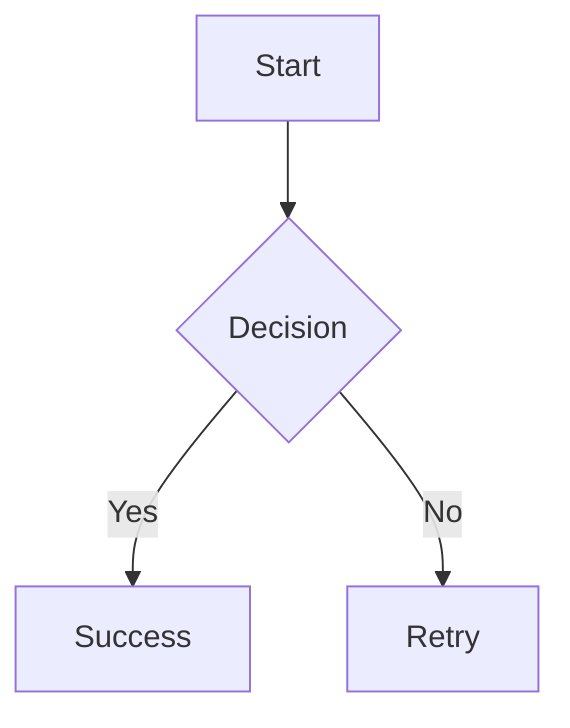
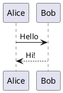

# MarkdownViewer - Lightweight Windows Desktop Markdown Viewer

Schlanker Windows Desktop-Viewer für Markdown-Dateien mit voller Windows Explorer Integration.


## Features

### Core Features
- ✅ **Markdown-Rendering** mit vollem CommonMark-Support
- ✅ **Syntax-Highlighting** für Code-Blöcke (via Highlight.js)
- ✅ **Mermaid Diagramme** (Flowcharts, Sequence, Class, State, Gantt, ER, etc.)
- ✅ **PlantUML Diagramme** (Class, Sequence, Use Case, Activity, Component, etc.)
- ✅ **Bilder** (inkl. Base64-embedded)
- ✅ **Tabellen, Listen, Blockquotes** (via Markdig Extensions)
- ✅ **Live-Reload** bei Dateiänderungen (FileSystemWatcher)
- ✅ **Copy-Buttons** für Code-Blöcke
- ✅ **Links**: MD-Dateien im Viewer, externe im Browser

### Windows Integration
- ✅ **Doppelklick** auf .md-Dateien → öffnet im Viewer
- ✅ **Rechtsklick-Kontextmenü** ("Open with Markdown Viewer")
- ✅ **"Open With"-Dialog** Integration
- ✅ **"Send To"-Menü** Integration
- ✅ **File Open Dialog** wenn ohne Parameter gestartet

### Eigenschaften
- 🚀 **Schnell**: 1.6 MB Single-File EXE
- 📦 **Portable**: Keine Installation erforderlich
- 🔒 **Keine Admin-Rechte**: Registry in HKCU
- 🧹 **Sauber deinstallierbar**: `--uninstall` entfernt alles

## Schnellstart

### Option 1: File Open Dialog
```bash
.\bin-single\MarkdownViewer.exe
# Öffnet Dialog zum Auswählen einer .md-Datei
```

### Option 2: Datei direkt öffnen
```bash
.\bin-single\MarkdownViewer.exe test-diagrams.md
```

### Option 3: Windows Explorer Integration
```bash
# Alle Integrationspunkte installieren
.\bin-single\MarkdownViewer.exe --install

# Danach: Doppelklick auf .md-Dateien im Explorer
# Oder: Rechtsklick → "Open with Markdown Viewer"
# Oder: Rechtsklick → "Senden an" → "Markdown Viewer"
```

## Installation & Deinstallation

### Installieren (empfohlen)
```bash
.\bin-single\MarkdownViewer.exe --install
```

**Was wird installiert:**
- Standard-Programm für .md-Dateien (Doppelklick)
- Kontextmenü-Eintrag "Open with Markdown Viewer"
- Eintrag in "Öffnen mit..."-Liste
- Verknüpfung im "Senden an"-Menü

**Keine Admin-Rechte erforderlich!** Alle Einträge in `HKEY_CURRENT_USER`

### Deinstallieren
```bash
.\bin-single\MarkdownViewer.exe --uninstall
```

Entfernt alle Registry-Einträge und Verknüpfungen. Die EXE selbst bleibt erhalten und kann manuell gelöscht werden.

## Diagramm-Support

### Mermaid Diagramme

Unterstützt alle Mermaid-Diagrammtypen:

````markdown

````

**Verfügbare Typen:**
- `graph` / `flowchart` - Flussdiagramme
- `sequenceDiagram` - Sequenzdiagramme
- `classDiagram` - Klassendiagramme
- `stateDiagram` - Zustandsdiagramme
- `erDiagram` - Entity-Relationship-Diagramme
- `gantt` - Gantt-Charts
- `pie` - Tortendiagramme
- `gitGraph` - Git-Graphen

### PlantUML Diagramme

Nutzt den öffentlichen PlantUML-Server für Rendering:

````markdown

````

**Verfügbare Typen:**
- Class Diagrams
- Sequence Diagrams
- Use Case Diagrams
- Activity Diagrams
- Component Diagrams
- State Diagrams
- Object Diagrams
- Deployment Diagrams

**Siehe `test-diagrams.md` für Beispiele!**

## Command-Line Optionen

```bash
# Datei öffnen
MarkdownViewer.exe <file.md>

# Windows Explorer Integration installieren
MarkdownViewer.exe --install

# Windows Explorer Integration deinstallieren
MarkdownViewer.exe --uninstall

# Version anzeigen
MarkdownViewer.exe --version

# Hilfe anzeigen
MarkdownViewer.exe --help
```

## Technologie-Stack

- **Sprache**: C# 12 (.NET 8 Managed Code)
- **UI Framework**: Windows Forms (WinForms)
- **Rendering**: WebView2 (Edge Chromium)
- **Markdown Parser**: Markdig 0.37.0
- **Syntax Highlighting**: Highlight.js 11.9.0 (CDN)
- **Diagramme**:
  - Mermaid.js 10 (CDN)
  - PlantUML Server (plantuml.com)
- **Build**: Single-File Deployment (.NET 8 Runtime required)

## Projektstruktur

```
misc/
├── markdown-viewer/
│   └── MarkdownViewer/
│       ├── Program.cs              # Entry Point, CLI-Handling, Registry
│       ├── MainForm.cs             # Main Window, WebView2, Markdown-Rendering
│       └── MarkdownViewer.csproj   # Projekt-Konfiguration
├── bin-single/
│   ├── MarkdownViewer.exe          # Single-File Executable (1.6 MB)
│   └── .cache/                     # WebView2 Cache (auto-generiert)
├── test-diagrams.md                # Test-Datei mit Mermaid & PlantUML
└── README.md                       # Diese Datei
```

## Build von Source

### Voraussetzungen
- .NET 8 SDK
- Windows 10/11
- WebView2 Runtime (auf Win10/11 vorinstalliert)

### Build-Befehl
```bash
cd markdown-viewer/MarkdownViewer

# Single-File EXE erstellen
dotnet publish -c Release -r win-x64 --self-contained false -p:PublishSingleFile=true -o ../../bin-single

# Output: ../../bin-single/MarkdownViewer.exe
```

### Development Build
```bash
dotnet build -c Debug
dotnet run -- test-diagrams.md
```

## Architektur

### Program.cs
- **Entry Point**: `Main(string[] args)`
- **CLI-Argument-Handling**: `--install`, `--uninstall`, `--help`, `--version`
- **Registry-Integration**: `InstallFileAssociation()`, `UninstallFileAssociation()`
- **Shortcut-Erstellung**: `CreateShortcut()` für "Send To"-Menü

### MainForm.cs
- **WebView2-Initialisierung**: Custom Cache-Ordner (`.cache`)
- **Markdown-zu-HTML-Konvertierung**: `ConvertMarkdownToHtml()`
- **HTML-Template**: Eingebettetes CSS, Highlight.js, Mermaid.js, PlantUML-Rendering
- **Live-Reload**: `FileSystemWatcher` überwacht Dateiänderungen
- **Link-Handling**: Externe Links im Browser, interne im Viewer

### Markdown-Rendering Pipeline
```
.md File
  ↓
Markdig (mit Advanced Extensions)
  ↓
HTML String
  ↓
Embedded CSS + Scripts (Highlight.js, Mermaid.js)
  ↓
WebView2.NavigateToString()
  ↓
Client-Side Processing:
  - Mermaid: Rendert direkt im Browser
  - PlantUML: Ersetzt Code-Block durch  vom Server
  - Highlight.js: Syntax-Highlighting für Code
  - Copy-Buttons: Dynamisch für Code-Blöcke hinzugefügt
```

## Registry-Einträge (nach --install)

Alle Einträge in `HKEY_CURRENT_USER` (keine Admin-Rechte):

```
HKCU\Software\Classes\.md
  (Default) = "MarkdownViewer.Document"

HKCU\Software\Classes\MarkdownViewer.Document
  (Default) = "Markdown Document"

HKCU\Software\Classes\MarkdownViewer.Document\shell\open\command
  (Default) = "C:\path\to\MarkdownViewer.exe" "%1"

HKCU\Software\Classes\SystemFileAssociations\.md\shell\MarkdownViewer
  (Default) = "Open with Markdown Viewer"
  Icon = "C:\path\to\MarkdownViewer.exe"

HKCU\Software\Classes\SystemFileAssociations\.md\shell\MarkdownViewer\command
  (Default) = "C:\path\to\MarkdownViewer.exe" "%1"

HKCU\Software\Classes\Applications\MarkdownViewer.exe
  FriendlyAppName = "Markdown Viewer"

HKCU\Software\Classes\Applications\MarkdownViewer.exe\SupportedTypes
  .md = ""
  .markdown = ""

HKCU\Software\Classes\Applications\MarkdownViewer.exe\shell\open\command
  (Default) = "C:\path\to\MarkdownViewer.exe" "%1"
```

Plus Verknüpfung in: `%APPDATA%\Microsoft\Windows\SendTo\Markdown Viewer.lnk`

## FAQ

**Q: Brauche ich .NET installiert?**
A: Ja, .NET 8 Runtime muss installiert sein. Auf den meisten modernen Windows-Systemen bereits vorhanden.

**Q: Funktionieren Diagramme offline?**
A: Mermaid funktioniert offline (nach erstem CDN-Load). PlantUML benötigt Internet-Verbindung zum Server.

**Q: Kann ich eigene Styles hinzufügen?**
A: Ja, im Code in `MainForm.cs` → `ConvertMarkdownToHtml()` → `<style>` Sektion.

**Q: Warum WebView2?**
A: WebView2 nutzt Edge Chromium Engine, ist auf Windows 10/11 vorinstalliert, und bietet perfektes HTML/CSS/JS-Rendering.

**Q: Kann ich die EXE umbenennen?**
A: Ja, aber führe danach `--install` erneut aus, damit die Registry die richtige EXE-Path hat.

## Lizenz

Dieses Projekt wurde als einfaches Tool entwickelt. Nutze es wie du willst!

## Links

- [Markdig](https://github.com/xoofx/markdig) - Markdown Parser
- [Mermaid.js](https://mermaid.js.org/) - Diagramm-Bibliothek
- [PlantUML](https://plantuml.com/) - UML-Diagramme
- [Highlight.js](https://highlightjs.org/) - Syntax-Highlighting
- [WebView2](https://developer.microsoft.com/en-us/microsoft-edge/webview2/) - Edge Chromium Rendering

---

**Entwickelt mit Claude Code** 🤖
