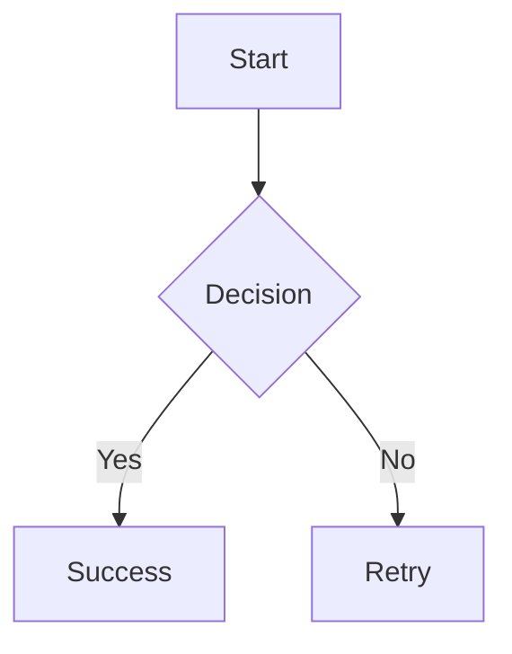
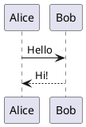

# MarkdownViewer - Lightweight Windows Desktop Markdown Viewer

Lightweight Windows desktop viewer for Markdown files with full Windows Explorer integration.


## Features

### Core Features
- ✅ **Markdown Rendering** with full CommonMark support
- ✅ **Syntax Highlighting** for code blocks (via Highlight.js)
- ✅ **Mermaid Diagrams** (flowcharts, sequence, class, state, gantt, ER, etc.)
- ✅ **PlantUML Diagrams** (class, sequence, use case, activity, component, etc.)
- ✅ **Images** (including base64-embedded)
- ✅ **Tables, Lists, Blockquotes** (via Markdig extensions)
- ✅ **Live Reload** on file changes (FileSystemWatcher)
- ✅ **Copy Buttons** for code blocks
- ✅ **Link Handling**: MD files open in viewer, external links in browser

### Windows Integration
- ✅ **Double-click** .md files → opens in viewer
- ✅ **Right-click context menu** ("Open with Markdown Viewer")
- ✅ **"Open With" dialog** integration
- ✅ **"Send To" menu** integration
- ✅ **File open dialog** when started without arguments

### Properties
- 🚀 **Fast**: 1.6 MB single-file executable
- 📦 **Portable**: No installation required
- 🔒 **No admin rights**: Registry entries in HKCU only
- 🧹 **Clean uninstall**: `--uninstall` removes everything

## Quick Start

### Option 1: File Open Dialog
```bash
.\bin-single\MarkdownViewer.exe
# Opens dialog to select a .md file
```

### Option 2: Open File Directly
```bash
.\bin-single\MarkdownViewer.exe test-diagrams.md
```

### Option 3: Windows Explorer Integration
```bash
# Install all integration points
.\bin-single\MarkdownViewer.exe --install

# Then: Double-click .md files in Explorer
# Or: Right-click → "Open with Markdown Viewer"
# Or: Right-click → "Send to" → "Markdown Viewer"
```

## Installation & Uninstallation

### Install (recommended)
```bash
.\bin-single\MarkdownViewer.exe --install
```

**What gets installed:**
- Default program for .md files (double-click)
- Context menu entry "Open with Markdown Viewer"
- Entry in "Open With" dialog
- Shortcut in "Send To" menu

**No admin rights required!** All entries in `HKEY_CURRENT_USER`

### Uninstall
```bash
.\bin-single\MarkdownViewer.exe --uninstall
```

Removes all registry entries and shortcuts. The executable remains and can be deleted manually.

## Diagram Support

### Mermaid Diagrams

Supports all Mermaid diagram types:

````markdown

````

**Available types:**
- `graph` / `flowchart` - Flow diagrams
- `sequenceDiagram` - Sequence diagrams
- `classDiagram` - Class diagrams
- `stateDiagram` - State diagrams
- `erDiagram` - Entity-relationship diagrams
- `gantt` - Gantt charts
- `pie` - Pie charts
- `gitGraph` - Git graphs

### PlantUML Diagrams

Uses public PlantUML server for rendering:

````markdown

````

**Available types:**
- Class Diagrams
- Sequence Diagrams
- Use Case Diagrams
- Activity Diagrams
- Component Diagrams
- State Diagrams
- Object Diagrams
- Deployment Diagrams

**See `test-diagrams.md` for examples!**

## Command-Line Options

```bash
# Open file
MarkdownViewer.exe <file.md>

# Install Windows Explorer integration
MarkdownViewer.exe --install

# Uninstall Windows Explorer integration
MarkdownViewer.exe --uninstall

# Show version
MarkdownViewer.exe --version

# Show help
MarkdownViewer.exe --help
```

## Technology Stack

- **Language**: C# 12 (.NET 8 Managed Code)
- **UI Framework**: Windows Forms (WinForms)
- **Rendering**: WebView2 (Edge Chromium)
- **Markdown Parser**: Markdig 0.37.0
- **Syntax Highlighting**: Highlight.js 11.9.0 (CDN)
- **Diagrams**:
  - Mermaid.js 10 (CDN)
  - PlantUML Server (plantuml.com)
- **Build**: Single-file deployment (.NET 8 Runtime required)

## Project Structure

```
mini-markdown-viewer/
├── markdown-viewer/
│   └── MarkdownViewer/
│       ├── Program.cs              # Entry point, CLI handling, registry
│       ├── MainForm.cs             # Main window, WebView2, rendering
│       └── MarkdownViewer.csproj   # Project configuration
├── test-diagrams.md                # Test file with Mermaid & PlantUML
└── README.md                       # This file
```

## Build from Source

### Prerequisites
- .NET 8 SDK
- Windows 10/11
- WebView2 Runtime (preinstalled on Win10/11)

### Build Command
```bash
cd markdown-viewer/MarkdownViewer

# Create single-file executable
dotnet publish -c Release -r win-x64 --self-contained false -p:PublishSingleFile=true -o ../../bin-single

# Output: ../../bin-single/MarkdownViewer.exe
```

### Development Build
```bash
dotnet build -c Debug
dotnet run -- test-diagrams.md
```

## Architecture

### Program.cs
- **Entry point**: `Main(string[] args)`
- **CLI argument handling**: `--install`, `--uninstall`, `--help`, `--version`
- **Registry integration**: `InstallFileAssociation()`, `UninstallFileAssociation()`
- **Shortcut creation**: `CreateShortcut()` for "Send To" menu

### MainForm.cs
- **WebView2 initialization**: Custom cache folder (`.cache`)
- **Markdown-to-HTML conversion**: `ConvertMarkdownToHtml()`
- **HTML template**: Embedded CSS, Highlight.js, Mermaid.js, PlantUML rendering
- **Live reload**: `FileSystemWatcher` monitors file changes
- **Link handling**: External links in browser, internal in viewer

### Markdown Rendering Pipeline
```
.md File
  ↓
Markdig (with advanced extensions)
  ↓
HTML String
  ↓
Embedded CSS + Scripts (Highlight.js, Mermaid.js)
  ↓
WebView2.NavigateToString()
  ↓
Client-side processing:
  - Mermaid: Renders directly in browser
  - PlantUML: Replaces code block with  from server
  - Highlight.js: Syntax highlighting for code
  - Copy buttons: Dynamically added to code blocks
```

## Registry Entries (after --install)

All entries in `HKEY_CURRENT_USER` (no admin rights required):

```
HKCU\Software\Classes\.md
  (Default) = "MarkdownViewer.Document"

HKCU\Software\Classes\MarkdownViewer.Document
  (Default) = "Markdown Document"

HKCU\Software\Classes\MarkdownViewer.Document\shell\open\command
  (Default) = "C:\path\to\MarkdownViewer.exe" "%1"

HKCU\Software\Classes\SystemFileAssociations\.md\shell\MarkdownViewer
  (Default) = "Open with Markdown Viewer"
  Icon = "C:\path\to\MarkdownViewer.exe"

HKCU\Software\Classes\SystemFileAssociations\.md\shell\MarkdownViewer\command
  (Default) = "C:\path\to\MarkdownViewer.exe" "%1"

HKCU\Software\Classes\Applications\MarkdownViewer.exe
  FriendlyAppName = "Markdown Viewer"

HKCU\Software\Classes\Applications\MarkdownViewer.exe\SupportedTypes
  .md = ""
  .markdown = ""

HKCU\Software\Classes\Applications\MarkdownViewer.exe\shell\open\command
  (Default) = "C:\path\to\MarkdownViewer.exe" "%1"
```

Plus shortcut in: `%APPDATA%\Microsoft\Windows\SendTo\Markdown Viewer.lnk`

## FAQ

**Q: Do I need .NET installed?**
A: Yes, .NET 8 Runtime is required. Pre-installed on most modern Windows systems.

**Q: Do diagrams work offline?**
A: Mermaid works offline (after first CDN load). PlantUML requires internet connection to server.

**Q: Can I add custom styles?**
A: Yes, in `MainForm.cs` → `ConvertMarkdownToHtml()` → `<style>` section.

**Q: Why WebView2?**
A: WebView2 uses Edge Chromium engine, is preinstalled on Windows 10/11, and provides perfect HTML/CSS/JS rendering.

**Q: Can I rename the executable?**
A: Yes, but run `--install` again afterwards so registry entries reference the correct path.

## License

MIT License - see LICENSE file for details.

## Links

- [Markdig](https://github.com/xoofx/markdig) - Markdown parser
- [Mermaid.js](https://mermaid.js.org/) - Diagram library
- [PlantUML](https://plantuml.com/) - UML diagrams
- [Highlight.js](https://highlightjs.org/) - Syntax highlighting
- [WebView2](https://developer.microsoft.com/en-us/microsoft-edge/webview2/) - Edge Chromium rendering

---

**Built with Claude Code** 🤖
