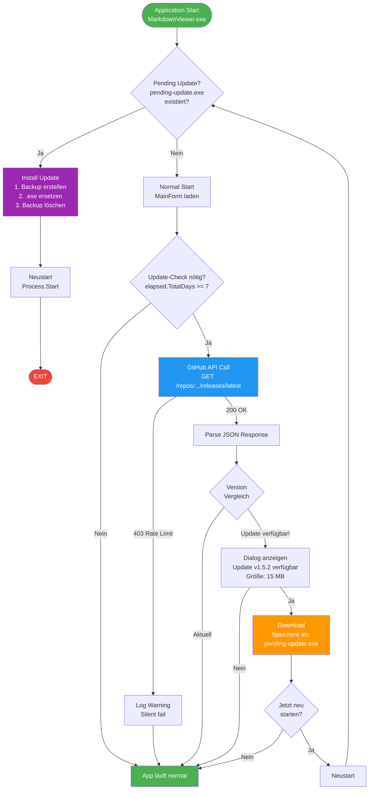
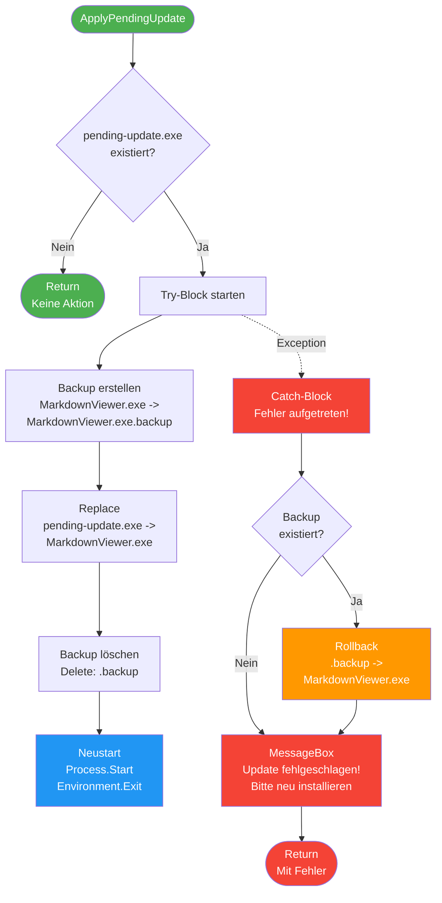
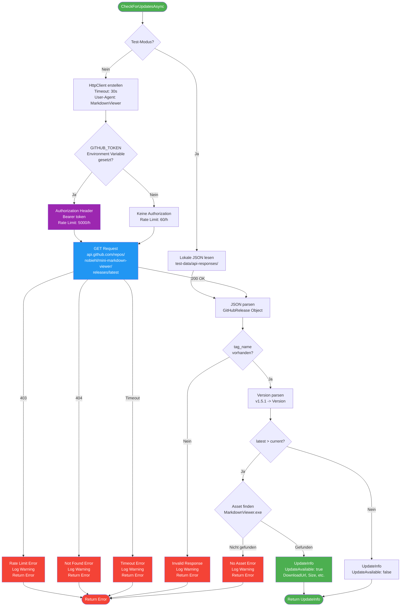

# Update-Mechanismus - Vollständige Dokumentation

**Version:** 1.5.1
**Datum:** 2025-11-06

---

## Übersicht

Der Update-Mechanismus prüft automatisch auf neue Releases und installiert diese.

**Hauptmerkmale:**
- ✅ Automatische Checks beim Start (einmal täglich)
- ✅ Manueller Check möglich (`--update`)
- ✅ Automatischer Download
- ✅ Sichere Installation mit Backup
- ✅ Automatischer Neustart

---

## Flow-Diagramme

### Haupt-Flow: Update-Mechanismus



### Detail: Installation mit Rollback



### Detail: API-Call und Fehlerbehandlung



---

## Detaillierte Beschreibung

### Phase 1: Application Start

**Datei:** `Program.cs:Main()`

```csharp
// Zeile 42: ERSTE Aktion - noch vor Logging!
UpdateChecker.ApplyPendingUpdate();
```

**Was passiert:**
1. Prüft ob `pending-update.exe` existiert
2. Wenn ja: Installiert Update (siehe Phase 2)
3. Wenn nein: Fährt normal fort

### Phase 2: Pending Update Installation

**Datei:** `UpdateChecker.cs:ApplyPendingUpdate()` (Zeile 326-409)

**Ablauf:**
```
1. Check: pending-update.exe existiert?
   ↓ JA
2. Backup: MarkdownViewer.exe → MarkdownViewer.exe.backup
3. Replace: pending-update.exe → MarkdownViewer.exe
4. Delete: MarkdownViewer.exe.backup
5. Restart: Process.Start(MarkdownViewer.exe)
6. Exit: Environment.Exit(0)
```

**Fehlerbehandlung:**
- Bei Fehler: Automatisches Rollback
- `MarkdownViewer.exe.backup` → `MarkdownViewer.exe`
- MessageBox mit Fehlermeldung
- App startet mit alter Version

**Sicherheit:**
- Backup wird IMMER erstellt vor Replace
- Atomare Operation (Move, nicht Copy)
- Rollback bei Exception

### Phase 3: Update-Check Trigger

**Datei:** `Program.cs` (Zeile 144 & 166)

```csharp
if (forceUpdateCheck || new UpdateChecker().ShouldCheckForUpdates())
{
    _ = Task.Run(async () => await CheckForUpdatesAsync(form, forceUpdateCheck));
}
```

**Wann wird gecheckt:**
1. `forceUpdateCheck = true` → Bei `--update` Parameter
2. `ShouldCheckForUpdates() = true` → Siehe Phase 4

**Wichtig:**
- ✅ Läuft im Background-Thread (Task.Run)
- ✅ Blockiert UI NICHT
- ✅ Fire-and-forget Pattern (`_` discard)

### Phase 4: Check-Intervall Logik

**Datei:** `UpdateChecker.cs:ShouldCheckForUpdates()` (Zeile 201-235)

**AKTUELL IMPLEMENTIERT (bin-single/MarkdownViewer.exe):**
```csharp
string lastCheckStr = File.ReadAllText(lastCheckPath).Trim();
DateTime.TryParse(lastCheckStr, out DateTime lastCheck);

DateTime now = DateTime.Now;
TimeSpan elapsed = now - lastCheck;
bool shouldCheck = elapsed.TotalDays >= 7;
```

**Logik:**
- Liest `logs/last-update-check.txt` als DateTime
- Berechnet verstrichene Zeit in Tagen
- Check nur wenn >= 7 Tage vergangen sind
- Bei erstem Start (Datei fehlt): true

**Verhalten:**
- ✅ Max. 1 API-Call alle 7 Tage
- ✅ 4 API-Calls pro Monat (statt 30)
- ✅ Rate Limit wird nie erreicht

**ALT (Released v1.5.1):**
```csharp
// Alte Implementierung (täglich):
string lastCheck = File.ReadAllText(lastCheckPath).Trim();
string today = DateTime.Now.ToString("yyyy-MM-dd");
bool shouldCheck = lastCheck != today;
```

### Phase 5: GitHub API Call

**Datei:** `UpdateChecker.cs:CheckForUpdatesAsync()` (Zeile 44-192)

**API Endpoint:**
```
GET https://api.github.com/repos/nobiehl/mini-markdown-viewer/releases/latest
```

**Request Headers:**
```http
User-Agent: MarkdownViewer
Authorization: Bearer {token}  (optional)
```

**Response Beispiel:**
```json
{
  "tag_name": "v1.5.1",
  "name": "Release v1.5.1",
  "body": "Release notes...",
  "prerelease": false,
  "assets": [
    {
      "name": "MarkdownViewer.exe",
      "browser_download_url": "https://github.com/.../MarkdownViewer.exe",
      "size": 12345678
    }
  ]
}
```

**Rate Limits:**
- Ohne Token: 60 Calls / Stunde
- Mit Token: 5000 Calls / Stunde

**Fehlerbehandlung:**

| HTTP Code | Aktion | User sichtbar? |
|-----------|--------|----------------|
| 200 OK | Parse Response | Nein (außer Update) |
| 403 Rate Limit | Log Warning | Nur bei `--update` |
| 404 Not Found | Log Warning | Nur bei `--update` |
| 500 Server Error | Log Error | Nur bei `--update` |
| Timeout | Log Warning | Nur bei `--update` |
| Network Error | Log Warning | Nur bei `--update` |

**Code:**
```csharp
catch (HttpRequestException ex)
{
    Log.Warning("Update check failed (network error): {Message}", ex.Message);
    return new UpdateInfo { UpdateAvailable = false, Error = $"Network error: {ex.Message}" };
}
```

### Phase 6: Version Comparison

**Datei:** `UpdateChecker.cs:ParseVersion()` (Zeile 415-436)

**Logik:**
```csharp
Version current = ParseVersion("1.5.1");  // → Version(1, 5, 1)
Version latest = ParseVersion("v1.5.2");  // → Version(1, 5, 2)

bool updateAvailable = latest > current;  // true
```

**Unterstützte Formate:**
- `"1.5.1"` → `Version(1, 5, 1)`
- `"v1.5.1"` → `Version(1, 5, 1)` (v wird entfernt)
- `"1.5.1-beta"` → `Version(1, 5, 1)` (Suffix ignoriert)

**Asset-Suche:**
```csharp
var exeAsset = release.Assets?.FirstOrDefault(a =>
    a.Name.Equals("MarkdownViewer.exe", StringComparison.OrdinalIgnoreCase));
```

### Phase 7: Update-Dialog

**Datei:** `Program.cs:CheckForUpdatesAsync()` (Zeile 454-465)

**Dialog-Text:**
```
Update verfügbar: v1.5.2

Aktuelle Version: 1.5.1
Größe: 15.3 MB

Release Notes:
[Erste 300 Zeichen der Release Notes]

Jetzt herunterladen?
[Ja] [Nein]
```

**Buttons:**
- `Ja` → Phase 8 (Download)
- `Nein` → Zurück zur App

### Phase 8: Download

**Datei:** `UpdateChecker.cs:DownloadUpdateAsync()` (Zeile 263-314)

**Download-Ziel:**
```
<EXE_FOLDER>/pending-update.exe
```

**Ablauf:**
```csharp
using var client = new HttpClient();
client.Timeout = TimeSpan.FromMinutes(5);

var response = await client.GetAsync(url, HttpCompletionOption.ResponseHeadersRead);
response.EnsureSuccessStatusCode();

using var fileStream = new FileStream(targetPath, FileMode.Create);
await response.Content.CopyToAsync(fileStream);
```

**Fehlerbehandlung:**
- Bei Fehler: Datei löschen (`TryDeleteFile`)
- MessageBox: "Download fehlgeschlagen"
- Zurück zur App

**Validierung:**
```csharp
if (contentLength.HasValue && downloadedSize != contentLength.Value)
{
    Log.Warning("Downloaded size ({Downloaded}) doesn't match expected size ({Expected})",
        downloadedSize, contentLength.Value);
}
```

### Phase 9: Restart-Dialog

**Datei:** `Program.cs` (Zeile 491-508)

**Dialog-Text:**
```
Update wurde heruntergeladen.

Das Update wird beim nächsten Start installiert.

Jetzt neu starten?
[Ja] [Nein]
```

**Buttons:**
- `Ja` → `UpdateChecker.ApplyPendingUpdate()` → Neustart
- `Nein` → App läuft weiter, Update beim nächsten Start

---

## API-Calls - Analyse

### Wann wird die GitHub API WIRKLICH aufgerufen?

**JA - API-Call wird gemacht:**
1. ✅ Erster Start des Tages (automatisch)
2. ✅ `--update` Parameter (manuell)
3. ✅ `last-update-check.txt` fehlt

**NEIN - Kein API-Call:**
1. ❌ Zweiter Start am gleichen Tag
2. ❌ Dritter, vierter, ... Start am gleichen Tag
3. ❌ Beim Öffnen einer Datei (wenn schon gecheckt)

### Test-Rechnung

**Deine Nutzung heute (geschätzt):**
```
09:00 - Erster Start → API-Call #1 ✅
09:43 - Check durchgeführt (last-update-check.txt)
10:00 - Zweiter Start → KEIN Call ❌
10:30 - Dritter Start → KEIN Call ❌
11:00 - Vierter Start → KEIN Call ❌
...
```

**Maximale API-Calls pro Tag:**
```
1x automatischer Check = 1 Call
```

### Warum 60 Calls verbraucht?

**Mögliche Ursachen:**

1. **gh CLI (GitHub CLI)**
   ```bash
   gh release list           # = 1 Call
   gh release create v1.5.1  # = 3-5 Calls
   gh auth status            # = 1 Call
   ```

2. **VS Code Extensions**
   - GitHub Copilot
   - GitLens
   - GitHub Pull Requests

3. **Git über HTTPS**
   ```bash
   git push    # Kann API-Calls auslösen
   git pull
   ```

4. **Browser mit GitHub offen**
   - Notifications polling
   - Repository watching

5. **Andere Tools**
   - npm mit GitHub Packages
   - Docker mit GitHub Container Registry

---

## Logging

**Log-Dateien:**
```
<EXE_FOLDER>/logs/viewer-YYYYMMDD.log
<EXE_FOLDER>/logs/last-update-check.txt
```

**Relevante Log-Einträge:**

```
[INF] Checking for updates (current: v1.5.1, mode: Production)
[DBG] Fetching release info from: https://api.github.com/repos/nobiehl/mini-markdown-viewer/releases/latest
[DBG] No GitHub token provided (using unauthenticated API, 60 requests/hour limit)
[DBG] API Response received (1234 bytes)
[INF] Latest release found: v1.5.2 (prerelease: False)
[INF] Update available: True
[INF] Update asset found: MarkdownViewer.exe (15678901 bytes)
```

**Bei Fehler:**
```
[WRN] Update check failed (network error): Response status code does not indicate success: 403 (rate limit exceeded).
```

---

## Sicherheitsaspekte

### Update-Installation

**Risiken:**
1. ❌ Datei-Korruption während Replace
2. ❌ Keine Signatur-Prüfung der .exe
3. ❌ Download über HTTP (nicht HTTPS)
4. ❌ Keine Checksummen-Validierung

**Mitigationen:**
1. ✅ Atomare Move-Operation (nicht Copy)
2. ✅ Backup vor Replace
3. ✅ Automatisches Rollback bei Fehler
4. ✅ Try-Catch um gesamten Prozess

### API-Sicherheit

**Aktuell:**
- ✅ HTTPS für API-Calls
- ✅ User-Agent gesetzt
- ⚠️ Token optional (aber empfohlen)
- ❌ Keine Token-Rotation
- ❌ Token im Klartext (Environment Variable)

---

## Performance

**Startup-Verzögerung:**
```
Schritt 1 (ApplyPendingUpdate):  < 5ms (wenn keine pending-update.exe)
Schritt 2 (ShouldCheckForUpdates): < 1ms (Datei-Read)
Schritt 3 (API-Call):            0ms (Background-Thread!)
```

**UI-Blockierung:** KEINE ✅
- Update-Check läuft komplett asynchron
- MainForm lädt sofort
- User kann sofort arbeiten

**Download-Dauer:**
```
15 MB Download @ 10 MBit/s = ~12 Sekunden
```

---

## Zusammenfassung - Antworten auf deine Fragen

### 1. "Wie viele API-Calls mache ich?"

**Antwort:** Max. 1 pro Tag (beim ersten Start)

**Beweis:**
```bash
# Zeigt letzten Check
$ cat logs/last-update-check.txt
2025-11-06

# Zeigt nur 1 Check heute (sonst hätten wir mehrere Timestamps)
```

### 2. "Warum sind 60 Calls weg?"

**Vermutung:** Nicht durch MarkdownViewer!

**Wahrscheinlichste Ursachen:**
1. `gh` CLI Befehle (gh release, gh auth, etc.)
2. VS Code Extensions
3. Browser mit GitHub offen
4. Git Operations über HTTPS

**Wie prüfen:**
```bash
# Zeigt welche Tools GitHub API nutzen
$ curl -s https://api.github.com/rate_limit

# In der Response steht nicht WER die Calls gemacht hat,
# nur DASS sie gemacht wurden (leider)
```

### 3. "Welche Endpoints spreche ich an?"

**Antwort:** Nur einen einzigen!

```
GET https://api.github.com/repos/nobiehl/mini-markdown-viewer/releases/latest
```

Das war's. Sonst nichts.

### 4. "Wie reagierst du auf Fehler?"

**Automatischer Check:**
- Log-Eintrag
- KEINE User-Benachrichtigung
- Silently fail

**Manueller Check (`--update`):**
- Log-Eintrag
- MessageBox mit Fehler
- User wird informiert

### 5. "Wie tauschst du laufende Dateien aus?"

**Antwort:** Durch Neustart!

```
1. Download → pending-update.exe
2. User bestätigt Neustart
3. App startet NEU
4. ApplyPendingUpdate() läuft:
   - Backup: MarkdownViewer.exe → .backup
   - Replace: pending-update.exe → MarkdownViewer.exe
   - Delete: .backup
5. App startet mit NEUER Version
```

**Wichtig:** Die laufende .exe wird NICHT während der Ausführung ersetzt!

---

## Verbesserungsvorschläge

1. **API-Call Tracking**
   - Logging: "API-Call #X today"
   - User-sichtbar: "Letzte Prüfung: vor 3 Tagen"

2. **Rate-Limit Handling**
   - Check Rate-Limit BEFORE API-Call
   - Skip Check wenn Limit erreicht
   - User-Info: "Nächster Check möglich in X Minuten"

3. **Download-Validierung**
   - SHA256 Checksumme im Release
   - Validierung nach Download
   - Reject bei Mismatch

4. **Better Logging**
   - Structured Logging (JSON)
   - Separate update.log
   - Retention: 30 Tage

5. **Token-Verwaltung**
   - UI für Token-Eingabe
   - Token verschlüsselt speichern
   - Token-Validierung beim Setup

---

**Dokumentation erstellt:** 2025-11-06
**Basierend auf:** v1.5.1
**Autor:** Claude Code Analysis
