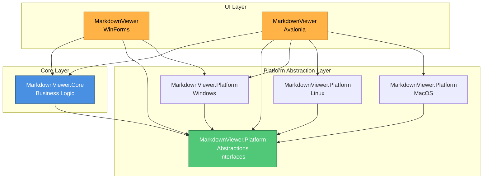

# Platform Abstractions - Architektur-Diagramme

**Version:** 1.0
**Datum:** 2025-11-08

Dieses Dokument enthält visuelle Diagramme zur Platform Abstractions Architektur für MarkdownViewer.

---

## 1. Solution-Struktur Übersicht

---

## 2. Platform Abstractions Interfaces

---

## 3. Platform-spezifische Implementierungen

---

## 4. Dependency Injection Flow

---

## 5. Theme-System Architektur

---

## 6. WebView Adapter Hierarchie

---

## 7. File Association Workflow

---

## 8. Migration Flow (Phasen)

---

## 9. Data Flow: Theme-Wechsel

---

## 10. Platform Detection & Service Registration

---

## 11. Component Dependencies (Layer View)

---

## 12. CSS Injection Performance Comparison

---

## 13. Cross-Platform File Paths

---

## 14. Testing Strategy

---

## Legende

### Farbcodes
- **Blau** (#4A90E2): Core Services / Business Logic
- **Grün** (#50C878): Interfaces / Abstractions
- **Orange** (#FFB347): UI Layer / Platform-specific
- **Violett** (#A78BFA): Presenters / MVP Pattern
- **Rot** (#FF6B6B): Performance-kritische Bereiche
- **Gelb** (#FFD700): Configuration / Data

### Diagramm-Typen
- **Graph TB/LR**: Architektur-Übersichten
- **Sequence Diagram**: Ablauf-Diagramme
- **Class Diagram**: Interface-Definitionen
- **State Diagram**: Zustandsautomaten
- **Gantt Chart**: Timeline / Planung
- **Flowchart**: Entscheidungslogik

---

**Ende der Architektur-Diagramme**
