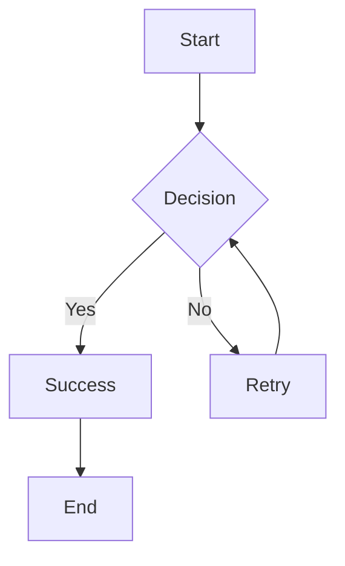
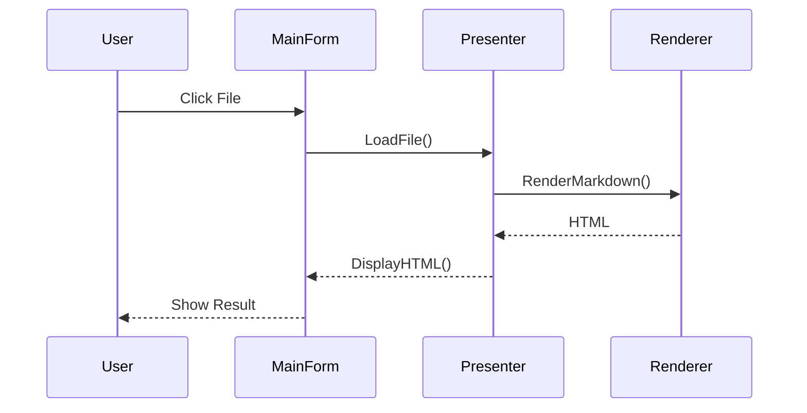
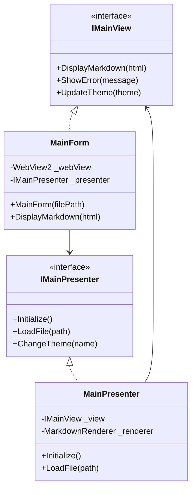
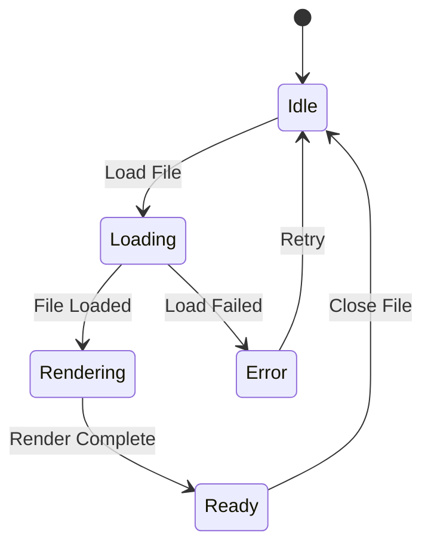
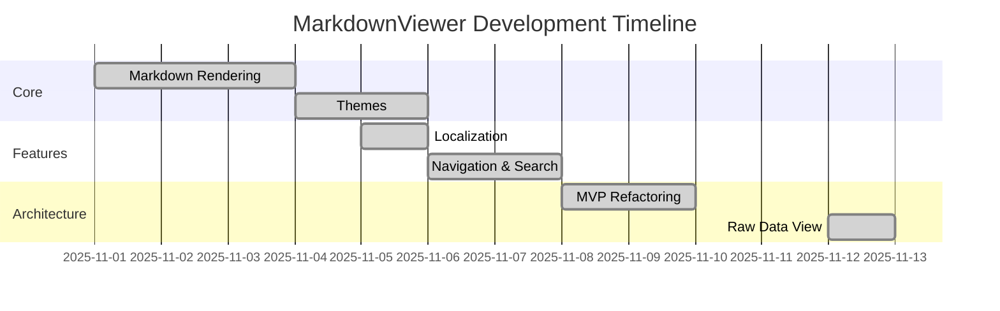
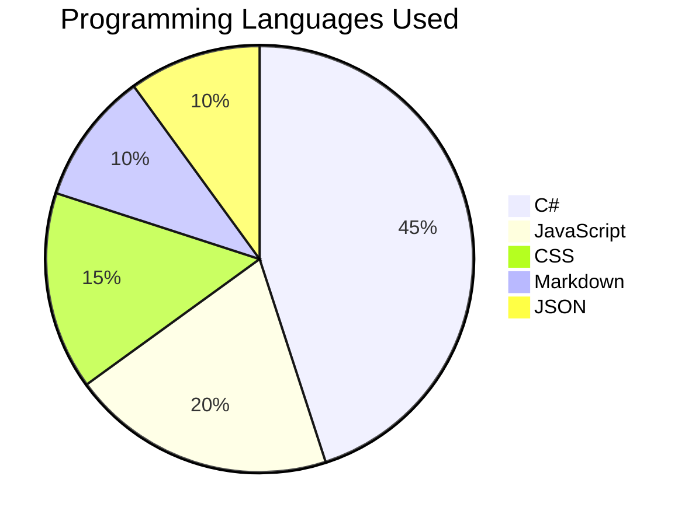
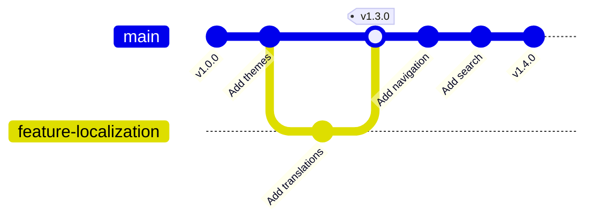
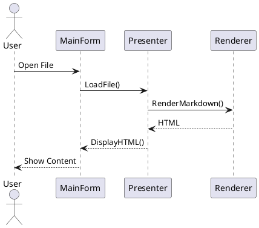
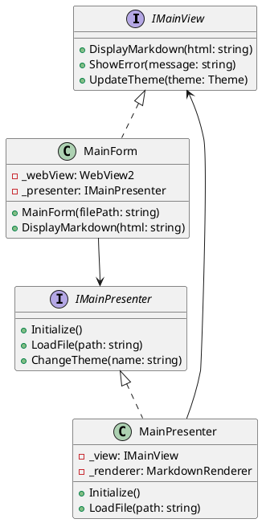
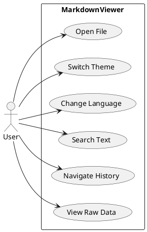

# MarkdownViewer Feature Showcase

**Complete demonstration of all MarkdownViewer v1.10.0 features with code examples and rendered output.**

This document demonstrates every feature supported by MarkdownViewer, showing both the Markdown source code and the rendered result.

---

[TOC]

---

## 1. Auto Table of Contents

### How to use

**Code:**
````markdown
[TOC]
````

**Rendered:** See the table of contents above - it was auto-generated from all headings in this document!

**Features:**
- Automatically generated from all headings (h1-h6)
- Hierarchical structure with proper nesting
- Clickable links to sections
- Styled box with border and background

---

## 2. Text Formatting

### Basic Formatting

**Code:**
```markdown
**Bold text** and __also bold__
*Italic text* and _also italic_
***Bold and italic*** and ___also bold and italic___
~~Strikethrough text~~
`Inline code` with backticks
```

**Rendered:**

**Bold text** and __also bold__
*Italic text* and _also italic_
***Bold and italic*** and ___also bold and italic___
~~Strikethrough text~~
`Inline code` with backticks

### Headings

**Code:**
```markdown
# Heading 1
## Heading 2
### Heading 3
#### Heading 4
##### Heading 5
###### Heading 6
```

**Rendered:**

# Heading 1
## Heading 2
### Heading 3
#### Heading 4
##### Heading 5
###### Heading 6

---

## 3. Emoji Support

### How to use

**Code:**
```markdown
:smile: :heart: :rocket: :warning: :star: :thumbsup: :fire: :tada:
:computer: :keyboard: :bulb: :zap: :mag: :wrench: :hammer: :gear:
:check: :x: :heavy_check_mark: :white_check_mark:
```

**Rendered:**

:smile: :heart: :rocket: :warning: :star: :thumbsup: :fire: :tada:
:computer: :keyboard: :bulb: :zap: :mag: :wrench: :hammer: :gear:
:check: :x: :heavy_check_mark: :white_check_mark:

### Emojis in text

I :heart: MarkdownViewer! :rocket: It's absolutely :fire:!

:warning: **Important:** Emoji codes like `:smile:` are automatically converted to Unicode emojis.

### Common categories

**People:** :smile: :laughing: :blush: :heart_eyes: :sunglasses: :thinking: :confused: :worried:
**Nature:** :sunny: :cloud: :umbrella: :snowflake: :zap: :rainbow: :ocean: :mountain:
**Food:** :pizza: :hamburger: :fries: :coffee: :tea: :beer: :wine_glass: :cake:
**Activities:** :soccer: :basketball: :trophy: :medal_sports: :art: :guitar: :books: :camera:
**Tech:** :computer: :keyboard: :mouse: :phone: :email: :floppy_disk: :cd: :dvd:

---

## 4. Mathematical Formulas (KaTeX)

### Inline Math

**Code:**
```markdown
The famous equation $E = mc^2$ was discovered by Einstein.
Pythagorean theorem: $a^2 + b^2 = c^2$
```

**Rendered:**

The famous equation $E = mc^2$ was discovered by Einstein.
Pythagorean theorem: $a^2 + b^2 = c^2$

### Display Math (Centered)

**Code:**
```markdown
$$
\int_{-\infty}^{\infty} e^{-x^2} dx = \sqrt{\pi}
$$
```

**Rendered:**

$$
\int_{-\infty}^{\infty} e^{-x^2} dx = \sqrt{\pi}
$$

### Quadratic Formula

**Code:**
```markdown
$$
x = \frac{-b \pm \sqrt{b^2 - 4ac}}{2a}
$$
```

**Rendered:**

$$
x = \frac{-b \pm \sqrt{b^2 - 4ac}}{2a}
$$

### Matrix

**Code:**
```markdown
$$
\begin{pmatrix}
a & b \\
c & d
\end{pmatrix}
$$
```

**Rendered:**

$$
\begin{pmatrix}
a & b \\
c & d
\end{pmatrix}
$$

### Summation and Limits

**Code:**
```markdown
$$
\sum_{i=1}^{n} i = \frac{n(n+1)}{2}
$$

$$
\lim_{x \to \infty} \frac{1}{x} = 0
$$
```

**Rendered:**

$$
\sum_{i=1}^{n} i = \frac{n(n+1)}{2}
$$

$$
\lim_{x \to \infty} \frac{1}{x} = 0
$$

### Greek Letters and Calculus

**Code:**
```markdown
$\alpha$, $\beta$, $\gamma$, $\delta$, $\epsilon$, $\pi$, $\sigma$, $\omega$

$$
\frac{d}{dx} \left( \int_a^b f(x) dx \right) = f(b) - f(a)
$$
```

**Rendered:**

$\alpha$, $\beta$, $\gamma$, $\delta$, $\epsilon$, $\pi$, $\sigma$, $\omega$

$$
\frac{d}{dx} \left( \int_a^b f(x) dx \right) = f(b) - f(a)
$$

---

## 5. Code Syntax Highlighting

### JavaScript

**Code:**
````markdown
```javascript
function fibonacci(n) {
    if (n <= 1) return n;
    return fibonacci(n - 1) + fibonacci(n - 2);
}

console.log(fibonacci(10)); // 55
```
````

**Rendered:**

```javascript
function fibonacci(n) {
    if (n <= 1) return n;
    return fibonacci(n - 1) + fibonacci(n - 2);
}

console.log(fibonacci(10)); // 55
```

### Python

**Code:**
````markdown
```python
def quicksort(arr):
    if len(arr) <= 1:
        return arr
    pivot = arr[len(arr) // 2]
    left = [x for x in arr if x < pivot]
    middle = [x for x in arr if x == pivot]
    right = [x for x in arr if x > pivot]
    return quicksort(left) + middle + quicksort(right)

print(quicksort([3,6,8,10,1,2,1]))
```
````

**Rendered:**

```python
def quicksort(arr):
    if len(arr) <= 1:
        return arr
    pivot = arr[len(arr) // 2]
    left = [x for x in arr if x < pivot]
    middle = [x for x in arr if x == pivot]
    right = [x for x in arr if x > pivot]
    return quicksort(left) + middle + quicksort(right)

print(quicksort([3,6,8,10,1,2,1]))
```

### C#

**Code:**
````markdown
```csharp
public class MarkdownRenderer
{
    private readonly MarkdownPipeline _pipeline;

    public MarkdownRenderer()
    {
        _pipeline = new MarkdownPipelineBuilder()
            .UseAdvancedExtensions()
            .UseMathematics()
            .Build();
    }

    public string RenderToHtml(string markdown)
    {
        return Markdown.ToHtml(markdown, _pipeline);
    }
}
```
````

**Rendered:**

```csharp
public class MarkdownRenderer
{
    private readonly MarkdownPipeline _pipeline;

    public MarkdownRenderer()
    {
        _pipeline = new MarkdownPipelineBuilder()
            .UseAdvancedExtensions()
            .UseMathematics()
            .Build();
    }

    public string RenderToHtml(string markdown)
    {
        return Markdown.ToHtml(markdown, _pipeline);
    }
}
```

### JSON

**Code:**
````markdown
```json
{
  "name": "MarkdownViewer",
  "version": "1.10.0",
  "features": [
    "Markdown Rendering",
    "Syntax Highlighting",
    "Math Support",
    "Themes",
    "Localization"
  ],
  "languages": 8,
  "themes": 4
}
```
````

**Rendered:**

```json
{
  "name": "MarkdownViewer",
  "version": "1.10.0",
  "features": [
    "Markdown Rendering",
    "Syntax Highlighting",
    "Math Support",
    "Themes",
    "Localization"
  ],
  "languages": 8,
  "themes": 4
}
```

---

## 6. Code Diff Highlighting

### How to use

**Code:**
````markdown
```diff
- This line was removed
+ This line was added
  This line is unchanged
- Old implementation: var x = 10;
+ New implementation: const x = 10;
```
````

**Rendered:**

```diff
- This line was removed
+ This line was added
  This line is unchanged
- Old implementation: var x = 10;
+ New implementation: const x = 10;
```

### Example: Refactoring

**Code:**
````markdown
```diff
  public class MainForm : Form
  {
-     private WebView2 _webView;
-     private string _currentFile;
+     private readonly WebView2 _webView;
+     private readonly IMainPresenter _presenter;

      public MainForm()
      {
          InitializeComponent();
+         _presenter = new MainPresenter(this);
-         LoadFile("README.md");
+         _presenter.Initialize();
      }
  }
```
````

**Rendered:**

```diff
  public class MainForm : Form
  {
-     private WebView2 _webView;
-     private string _currentFile;
+     private readonly WebView2 _webView;
+     private readonly IMainPresenter _presenter;

      public MainForm()
      {
          InitializeComponent();
+         _presenter = new MainPresenter(this);
-         LoadFile("README.md");
+         _presenter.Initialize();
      }
  }
```

---

## 7. Admonitions / Callouts

### Note (Blue)

**Code:**
```markdown
::: note
This is a note. Use it for general information.
:::
```

**Rendered:**

::: note
This is a note. Use it for general information.
:::

### Info (Cyan)

**Code:**
```markdown
::: info
This is informational content. Use it for additional context.
:::
```

**Rendered:**

::: info
This is informational content. Use it for additional context.
:::

### Tip (Green)

**Code:**
```markdown
::: tip
This is a helpful tip. Use it for best practices and recommendations.
:::
```

**Rendered:**

::: tip
This is a helpful tip. Use it for best practices and recommendations.
:::

### Warning (Orange)

**Code:**
```markdown
::: warning
This is a warning. Use it for potential issues or important considerations.
:::
```

**Rendered:**

::: warning
This is a warning. Use it for potential issues or important considerations.
:::

### Danger (Red)

**Code:**
```markdown
::: danger
This is a danger alert. Use it for critical warnings and breaking changes.
:::
```

**Rendered:**

::: danger
This is a danger alert. Use it for critical warnings and breaking changes.
:::

---

## 8. Tables

### Simple Table

**Code:**
```markdown
| Feature | Version | Status |
|---------|---------|--------|
| Markdown Rendering | 1.0.0 | ✅ |
| Themes | 1.2.0 | ✅ |
| Localization | 1.3.0 | ✅ |
| Navigation | 1.4.0 | ✅ |
| Raw Data View | 1.9.0 | ✅ |
```

**Rendered:**

| Feature | Version | Status |
|---------|---------|--------|
| Markdown Rendering | 1.0.0 | ✅ |
| Themes | 1.2.0 | ✅ |
| Localization | 1.3.0 | ✅ |
| Navigation | 1.4.0 | ✅ |
| Raw Data View | 1.9.0 | ✅ |

### Aligned Columns

**Code:**
```markdown
| Left Aligned | Center Aligned | Right Aligned |
|:-------------|:--------------:|--------------:|
| Left | Center | Right |
| Text | Text | Text |
| 123 | 456 | 789 |
```

**Rendered:**

| Left Aligned | Center Aligned | Right Aligned |
|:-------------|:--------------:|--------------:|
| Left | Center | Right |
| Text | Text | Text |
| 123 | 456 | 789 |

---

## 9. Lists

### Unordered List

**Code:**
```markdown
- Item 1
- Item 2
  - Nested item 2.1
  - Nested item 2.2
    - Deep nested item 2.2.1
- Item 3
```

**Rendered:**

- Item 1
- Item 2
  - Nested item 2.1
  - Nested item 2.2
    - Deep nested item 2.2.1
- Item 3

### Ordered List

**Code:**
```markdown
1. First item
2. Second item
   1. Nested item 2.1
   2. Nested item 2.2
3. Third item
```

**Rendered:**

1. First item
2. Second item
   1. Nested item 2.1
   2. Nested item 2.2
3. Third item

### Task List

**Code:**
```markdown
- [x] Completed task
- [x] Another completed task
- [ ] Pending task
- [ ] Another pending task
```

**Rendered:**

- [x] Completed task
- [x] Another completed task
- [ ] Pending task
- [ ] Another pending task

---

## 10. Blockquotes

### Simple Blockquote

**Code:**
```markdown
> This is a blockquote.
> It can span multiple lines.
```

**Rendered:**

> This is a blockquote.
> It can span multiple lines.

### Nested Blockquote

**Code:**
```markdown
> First level
>> Second level
>>> Third level
```

**Rendered:**

> First level
>> Second level
>>> Third level

### Blockquote with Citation

**Code:**
```markdown
> "The best way to predict the future is to invent it."
>
> — Alan Kay
```

**Rendered:**

> "The best way to predict the future is to invent it."
>
> — Alan Kay

---

## 11. Links

### External Links

**Code:**
```markdown
[Google](https://www.google.com)
[GitHub](https://github.com)
[MarkdownViewer Repository](https://github.com/nobiehl/mini-markdown-viewer)
```

**Rendered:**

[Google](https://www.google.com)
[GitHub](https://github.com)
[MarkdownViewer Repository](https://github.com/nobiehl/mini-markdown-viewer)

### Anchor Links (within document)

**Code:**
```markdown
[Jump to Emojis](#3-emoji-support)
[Jump to Math](#4-mathematical-formulas-katex)
[Jump to Mermaid Diagrams](#12-mermaid-diagrams)
```

**Rendered:**

[Jump to Emojis](#3-emoji-support)
[Jump to Math](#4-mathematical-formulas-katex)
[Jump to Mermaid Diagrams](#12-mermaid-diagrams)

### Relative Links (to other files)

**Code:**
```markdown
[README](../README.md)
[Changelog](CHANGELOG.md)
[Architecture](ARCHITECTURE.md)
```

**Rendered:**

[README](../README.md)
[Changelog](CHANGELOG.md)
[Architecture](ARCHITECTURE.md)

---

## 12. Mermaid Diagrams

### Flowchart

**Code:**
````markdown

````

**Rendered:**


### Sequence Diagram

**Code:**
````markdown

````

**Rendered:**


### Class Diagram

**Code:**
````markdown

````

**Rendered:**


### State Diagram

**Code:**
````markdown

````

**Rendered:**


### Gantt Chart

**Code:**
````markdown

````

**Rendered:**


### Pie Chart

**Code:**
````markdown

````

**Rendered:**


### Git Graph

**Code:**
````markdown

````

**Rendered:**


---

## 13. PlantUML Diagrams

### Sequence Diagram

**Code:**
````markdown

````

**Rendered:**


### Class Diagram

**Code:**
````markdown

````

**Rendered:**


### Use Case Diagram

**Code:**
````markdown

````

**Rendered:**


---

## 14. Chart.js Visualizations

### Line Chart

**Code:**
````markdown
```chart
{
  "type": "line",
  "data": {
    "labels": ["v1.0", "v1.2", "v1.3", "v1.4", "v1.5", "v1.6", "v1.7", "v1.8", "v1.9"],
    "datasets": [{
      "label": "Features",
      "data": [5, 12, 18, 24, 28, 32, 38, 45, 52],
      "borderColor": "rgb(75, 192, 192)",
      "backgroundColor": "rgba(75, 192, 192, 0.2)",
      "tension": 0.4
    }]
  },
  "options": {
    "responsive": true,
    "plugins": {
      "title": {
        "display": true,
        "text": "Feature Growth Over Versions"
      }
    }
  }
}
```
````

**Rendered:**

```chart
{
  "type": "line",
  "data": {
    "labels": ["v1.0", "v1.2", "v1.3", "v1.4", "v1.5", "v1.6", "v1.7", "v1.8", "v1.9"],
    "datasets": [{
      "label": "Features",
      "data": [5, 12, 18, 24, 28, 32, 38, 45, 52],
      "borderColor": "rgb(75, 192, 192)",
      "backgroundColor": "rgba(75, 192, 192, 0.2)",
      "tension": 0.4
    }]
  },
  "options": {
    "responsive": true,
    "plugins": {
      "title": {
        "display": true,
        "text": "Feature Growth Over Versions"
      }
    }
  }
}
```

### Bar Chart

**Code:**
````markdown
```chart
{
  "type": "bar",
  "data": {
    "labels": ["Markdown", "Themes", "i18n", "Nav", "Tests", "Docs"],
    "datasets": [{
      "label": "Lines of Code",
      "data": [1200, 850, 450, 680, 950, 320],
      "backgroundColor": [
        "rgba(255, 99, 132, 0.5)",
        "rgba(54, 162, 235, 0.5)",
        "rgba(255, 206, 86, 0.5)",
        "rgba(75, 192, 192, 0.5)",
        "rgba(153, 102, 255, 0.5)",
        "rgba(255, 159, 64, 0.5)"
      ]
    }]
  },
  "options": {
    "responsive": true,
    "plugins": {
      "title": {
        "display": true,
        "text": "Code Distribution by Component"
      }
    }
  }
}
```
````

**Rendered:**

```chart
{
  "type": "bar",
  "data": {
    "labels": ["Markdown", "Themes", "i18n", "Nav", "Tests", "Docs"],
    "datasets": [{
      "label": "Lines of Code",
      "data": [1200, 850, 450, 680, 950, 320],
      "backgroundColor": [
        "rgba(255, 99, 132, 0.5)",
        "rgba(54, 162, 235, 0.5)",
        "rgba(255, 206, 86, 0.5)",
        "rgba(75, 192, 192, 0.5)",
        "rgba(153, 102, 255, 0.5)",
        "rgba(255, 159, 64, 0.5)"
      ]
    }]
  },
  "options": {
    "responsive": true,
    "plugins": {
      "title": {
        "display": true,
        "text": "Code Distribution by Component"
      }
    }
  }
}
```

### Pie Chart

**Code:**
````markdown
```chart
{
  "type": "pie",
  "data": {
    "labels": ["English", "Deutsch", "Français", "Español", "Others"],
    "datasets": [{
      "data": [35, 25, 15, 12, 13],
      "backgroundColor": [
        "rgba(255, 99, 132, 0.7)",
        "rgba(54, 162, 235, 0.7)",
        "rgba(255, 206, 86, 0.7)",
        "rgba(75, 192, 192, 0.7)",
        "rgba(153, 102, 255, 0.7)"
      ]
    }]
  },
  "options": {
    "responsive": true,
    "plugins": {
      "title": {
        "display": true,
        "text": "User Language Distribution"
      }
    }
  }
}
```
````

**Rendered:**

```chart
{
  "type": "pie",
  "data": {
    "labels": ["English", "Deutsch", "Français", "Español", "Others"],
    "datasets": [{
      "data": [35, 25, 15, 12, 13],
      "backgroundColor": [
        "rgba(255, 99, 132, 0.7)",
        "rgba(54, 162, 235, 0.7)",
        "rgba(255, 206, 86, 0.7)",
        "rgba(75, 192, 192, 0.7)",
        "rgba(153, 102, 255, 0.7)"
      ]
    }]
  },
  "options": {
    "responsive": true,
    "plugins": {
      "title": {
        "display": true,
        "text": "User Language Distribution"
      }
    }
  }
}
```

### Doughnut Chart

**Code:**
````markdown
```chart
{
  "type": "doughnut",
  "data": {
    "labels": ["C#", "JavaScript", "CSS", "Markdown", "JSON"],
    "datasets": [{
      "data": [45, 20, 15, 10, 10],
      "backgroundColor": [
        "rgba(75, 192, 192, 0.7)",
        "rgba(255, 206, 86, 0.7)",
        "rgba(153, 102, 255, 0.7)",
        "rgba(255, 159, 64, 0.7)",
        "rgba(54, 162, 235, 0.7)"
      ]
    }]
  },
  "options": {
    "responsive": true,
    "plugins": {
      "title": {
        "display": true,
        "text": "Technology Stack Distribution"
      }
    }
  }
}
```
````

**Rendered:**

```chart
{
  "type": "doughnut",
  "data": {
    "labels": ["C#", "JavaScript", "CSS", "Markdown", "JSON"],
    "datasets": [{
      "data": [45, 20, 15, 10, 10],
      "backgroundColor": [
        "rgba(75, 192, 192, 0.7)",
        "rgba(255, 206, 86, 0.7)",
        "rgba(153, 102, 255, 0.7)",
        "rgba(255, 159, 64, 0.7)",
        "rgba(54, 162, 235, 0.7)"
      ]
    }]
  },
  "options": {
    "responsive": true,
    "plugins": {
      "title": {
        "display": true,
        "text": "Technology Stack Distribution"
      }
    }
  }
}
```

### Radar Chart

**Code:**
````markdown
```chart
{
  "type": "radar",
  "data": {
    "labels": ["Performance", "Features", "Usability", "Docs", "Tests", "i18n"],
    "datasets": [{
      "label": "v1.10.0",
      "data": [90, 95, 88, 85, 92, 90],
      "borderColor": "rgb(54, 162, 235)",
      "backgroundColor": "rgba(54, 162, 235, 0.2)"
    }, {
      "label": "v1.0.0",
      "data": [60, 40, 50, 30, 20, 0],
      "borderColor": "rgb(255, 99, 132)",
      "backgroundColor": "rgba(255, 99, 132, 0.2)"
    }]
  },
  "options": {
    "responsive": true,
    "plugins": {
      "title": {
        "display": true,
        "text": "Quality Metrics Comparison"
      }
    },
    "scales": {
      "r": {
        "min": 0,
        "max": 100
      }
    }
  }
}
```
````

**Rendered:**

```chart
{
  "type": "radar",
  "data": {
    "labels": ["Performance", "Features", "Usability", "Docs", "Tests", "i18n"],
    "datasets": [{
      "label": "v1.10.0",
      "data": [90, 95, 88, 85, 92, 90],
      "borderColor": "rgb(54, 162, 235)",
      "backgroundColor": "rgba(54, 162, 235, 0.2)"
    }, {
      "label": "v1.0.0",
      "data": [60, 40, 50, 30, 20, 0],
      "borderColor": "rgb(255, 99, 132)",
      "backgroundColor": "rgba(255, 99, 132, 0.2)"
    }]
  },
  "options": {
    "responsive": true,
    "plugins": {
      "title": {
        "display": true,
        "text": "Quality Metrics Comparison"
      }
    },
    "scales": {
      "r": {
        "min": 0,
        "max": 100
      }
    }
  }
}
```

---

## 15. Horizontal Rule

**Code:**
```markdown
Text above

---

Text below
```

**Rendered:**

Text above

---

Text below

---

## 16. Keyboard Shortcuts

### Display

Press <kbd>Ctrl</kbd> + <kbd>F</kbd> to search
Press <kbd>F5</kbd> to reload
Press <kbd>Alt</kbd> + <kbd>←</kbd> to go back
Press <kbd>F12</kbd> to toggle Raw Data View

---

## Summary

This document demonstrated **all 16 major feature categories** of MarkdownViewer v1.10.0:

1. ✅ Auto Table of Contents
2. ✅ Text Formatting (bold, italic, headings)
3. ✅ Emojis (:smile: :rocket: :heart:)
4. ✅ Mathematical Formulas (KaTeX)
5. ✅ Code Syntax Highlighting (JavaScript, Python, C#, JSON)
6. ✅ Code Diff Highlighting
7. ✅ Admonitions/Callouts (note, info, tip, warning, danger)
8. ✅ Tables (with alignment)
9. ✅ Lists (ordered, unordered, task lists)
10. ✅ Blockquotes (simple and nested)
11. ✅ Links (external, anchor, relative)
12. ✅ Mermaid Diagrams (flowchart, sequence, class, state, gantt, pie, git)
13. ✅ PlantUML Diagrams (sequence, class, use case)
14. ✅ Chart.js Visualizations (line, bar, pie, doughnut, radar)
15. ✅ Horizontal Rules
16. ✅ Keyboard Shortcuts Display

**Total:** Over 50+ individual examples with code and rendered output!

---

**Built with MarkdownViewer v1.10.0** :rocket:
