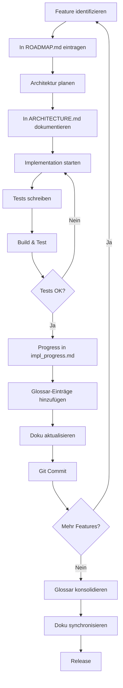

# Process Model - MarkdownViewer Development

Dieses Dokument beschreibt das Vorgehensmodell für die strukturierte Weiterentwicklung von MarkdownViewer ab v1.2.0.

## Zielsetzung

Saubere, testbare, wartbare Architektur mit klarer Dokumentation und nachvollziehbarem Fortschritt.

## Phasen

### Phase 1: Planung & Dokumentation
**REGEL:** Erst planen, dann implementieren!

#### 1.1 Anforderungsanalyse
- Features sammeln und priorisieren
- Technische Herausforderungen identifizieren
- Architekturentscheidungen treffen

#### 1.2 Roadmap erstellen
- Detaillierte Beschreibung aller Features
- Aufwandsschätzung pro Feature
- Abhängigkeiten dokumentieren
- In `ROADMAP.md` festhalten

#### 1.3 Architektur dokumentieren
- Neue Klassen/Services definieren
- Ordnerstruktur planen
- Interfaces definieren
- Dependencies klären
- In `ARCHITECTURE.md` festhalten

### Phase 2: Implementierung
**REGEL:** Nach jedem Abschnitt dokumentieren!

#### 2.1 Vor der Implementierung
- Aktuellen Abschnitt aus ROADMAP.md lesen
- Verstehen was zu tun ist
- Testfälle überlegen

#### 2.2 Während der Implementierung
- Code schreiben
- Unit Tests schreiben (parallel!)
- Refactoring durchführen
- Build erfolgreich durchführen

#### 2.3 Nach der Implementierung
- **SOFORT:** Progress in `impl_progress.md` festhalten (via printf)
  ```bash
  printf "\n## [$(date +%Y-%m-%d)] Session X - Feature Y\n\n**Status:** ✅ Completed\n\n**Changes:**\n- File1.cs: Added class X\n- Test1.cs: Added tests for X\n\n**Metrics:**\n- Lines added: XXX\n- Tests added: XX\n- Test coverage: XX%%\n\n**Next:**\n- [ ] Feature Z\n\n---\n" >> impl_progress.md
  ```

- Glossar-Einträge für neue Begriffe hinzufügen (via printf)
  ```bash
  printf "\n### ThemeManager\nManages application themes (Dark, Light, Solarized, Dräger). Applies theme to both Markdown rendering and WinForms UI.\n\n**File:** Services/ThemeManager.cs\n**Used by:** MainWindow, StatusBarManager\n\n" >> GLOSSARY.md
  ```

- Relevante Dokumentation aktualisieren (ARCHITECTURE.md, DEVELOPMENT.md)
- Git Commit mit aussagekräftiger Message

### Phase 3: Testing & Validation

#### 3.1 Unit Tests
- Alle neuen Services haben Tests
- Test Coverage >= 80%
- Tests laufen erfolgreich: `dotnet test`

##### 3.1.1 Link Navigation Tests (LinkNavigationHelperTests.cs - 30 Tests)

**ResolveRelativePath Tests (8 Tests):**
- [ ] ResolveRelativePath_WithAbsolutePath_ReturnsNormalizedPath
- [ ] ResolveRelativePath_WithRelativePath_ResolvesRelativeToCurrentFileDirectory
- [ ] ResolveRelativePath_WithRelativePathGoingUp_ResolvesCorrectly
- [ ] ResolveRelativePath_WithDeepRelativePath_ResolvesCorrectly
- [ ] ResolveRelativePath_WithNullLinkPath_ThrowsArgumentException
- [ ] ResolveRelativePath_WithEmptyLinkPath_ThrowsArgumentException
- [ ] ResolveRelativePath_WithNullCurrentFile_ThrowsArgumentException
- [ ] Integration_ResolveAndValidateLocalMarkdownLink_Success

**GetLinkType Tests (8 Tests):**
- [ ] GetLinkType_WithHttpUrl_ReturnsExternalHttp
- [ ] GetLinkType_WithHttpsUrl_ReturnsExternalHttp
- [ ] GetLinkType_WithAnchorLink_ReturnsAnchor
- [ ] GetLinkType_WithMarkdownFile_ReturnsLocalMarkdown
- [ ] GetLinkType_WithMarkdownExtension_ReturnsLocalMarkdown
- [ ] GetLinkType_WithUnknownLink_ReturnsUnknown
- [ ] GetLinkType_WithNullLink_ReturnsUnknown
- [ ] GetLinkType_WithEmptyLink_ReturnsUnknown

**ValidateFileExists Tests (4 Tests):**
- [ ] ValidateFileExists_WithExistingFile_ReturnsTrue
- [ ] ValidateFileExists_WithNonExistentFile_ReturnsFalse
- [ ] ValidateFileExists_WithNullPath_ReturnsFalse
- [ ] ValidateFileExists_WithEmptyPath_ReturnsFalse

**IsInlineResource Tests (8 Tests):**
- [ ] IsInlineResource_WithPlantUmlUrl_ReturnsTrue
- [ ] IsInlineResource_WithCdnUrl_ReturnsTrue
- [ ] IsInlineResource_WithImageUrl_ReturnsTrue
- [ ] IsInlineResource_WithJpgUrl_ReturnsTrue
- [ ] IsInlineResource_WithSvgUrl_ReturnsTrue
- [ ] IsInlineResource_WithRegularWebPage_ReturnsFalse
- [ ] IsInlineResource_WithNullUrl_ReturnsFalse
- [ ] IsInlineResource_WithEmptyUrl_ReturnsFalse

**Integration Tests (2 Tests):**
- [ ] Integration_ResolveAndValidateLocalMarkdownLink_Success
- [ ] Integration_ResolveAndValidateMissingFile_Fails

**Kommando zum Ausführen:**
```bash
cd markdown-viewer/MarkdownViewer.Tests
dotnet test --verbosity normal
```

#### 3.2 Integration Tests

##### 3.2.1 Link Navigation Integration Tests
**Manual Testing durchführen mit test-links.md:**

**External Links:**
- [ ] HTTP Link (http://www.google.com) öffnet im Browser
- [ ] HTTPS Link (https://github.com) öffnet im Browser
- [ ] PlantUML inline resources werden NICHT im Browser geöffnet
- [ ] CDN resources (jsdelivr, cloudflare) werden NICHT im Browser geöffnet

**Local File Links:**
- [ ] Relative Link zu existierender Datei (test.md) funktioniert
- [ ] Relative Link mit Verzeichnis (docs/file.md) funktioniert
- [ ] Relative Link nach oben (../README.md) funktioniert
- [ ] Absolute Pfad Link funktioniert
- [ ] Link zu nicht-existierender Datei wird geloggt (KEIN MessageBox!)
- [ ] FileWatcher crasht NICHT bei relativen Pfaden

**Anchor Links:**
- [ ] Anchor Link (#external-links) scrollt zur Section
- [ ] Anchor Link (#local-links) scrollt zur Section
- [ ] Anchor Link zu nicht-existierender Section scrollt nicht (aber crasht nicht)

**Logging:**
- [ ] Alle Link-Klicks werden geloggt (Link-Typ, Quelle, Ziel)
- [ ] Pfad-Auflösung wird geloggt (relativ → absolut)
- [ ] File-Existenz-Checks werden geloggt
- [ ] Fehlgeschlagene Navigationen werden geloggt
- [ ] KEINE MessageBox-Dialoge bei fehlenden Dateien!

**Test-Kommando:**
```bash
# Starte App mit test-links.md
cd markdown-viewer/MarkdownViewer/bin/Release/net8.0-windows
./MarkdownViewer.exe "C:\develop\workspace\misc\test-links.md"

# Prüfe Logs
cat logs/viewer-YYYYMMDD.log | grep "Link type:"
cat logs/viewer-YYYYMMDD.log | grep "Path resolution:"
cat logs/viewer-YYYYMMDD.log | grep "File not found:"
```

#### 3.3 Theme Tests
- [ ] Theme wird beim Start korrekt angewendet (kein "Mischmasch")
- [ ] Statusbar hat korrekte Theme-Farben beim Start
- [ ] Icons sind sichtbar auf allen Themes (dark, light, solarized, draeger)
- [ ] Theme-Wechsel zur Laufzeit funktioniert
- [ ] Icons werden bei Theme-Wechsel regeneriert
- [ ] Settings werden gespeichert

#### 3.4 File Watching Tests
- [ ] File Watcher funktioniert mit absoluten Pfaden
- [ ] File Watcher funktioniert mit relativen Pfaden (nach Auflösung!)
- [ ] File Watcher crasht NICHT bei fehlenden Verzeichnissen
- [ ] Änderungen an Datei triggern Reload
- [ ] File Watcher wird korrekt disposed

#### 3.5 Dokumentation prüfen
- [ ] Alle neuen Features dokumentiert?
- [ ] Code-Kommentare vorhanden?
- [ ] GLOSSARY.md vollständig?
- [ ] impl_progress.md aktualisiert?

### Phase 4: Konsolidierung

#### 4.1 Glossar konsolidieren
- Duplikate entfernen
- Alphabetisch sortieren
- Cross-References hinzufügen
- Mit Dokumentation abgleichen

#### 4.2 Dokumentation synchronisieren
- ARCHITECTURE.md mit aktuellem Code abgleichen
- DEVELOPMENT.md aktualisieren
- README.md bei Bedarf anpassen
- DEPLOYMENT-GUIDE.md prüfen

#### 4.3 Release vorbereiten
- Version bump
- CHANGELOG.md erstellen
- Release Notes schreiben
- Build testen

## Dokumentationsstruktur

```
mini-markdown-viewer/
├── PROCESS-MODEL.md          # Dieses Dokument
├── ROADMAP.md                # Detaillierter Fahrplan
├── ARCHITECTURE.md           # Architektur-Übersicht
├── impl_progress.md          # Implementierungs-Fortschritt (chronologisch)
├── GLOSSARY.md               # Begriffe & Definitionen
├── DEVELOPMENT.md            # Developer Docs
├── DEPLOYMENT-GUIDE.md       # Deployment Process
└── README.md                 # User Docs
```

## Workflow pro Feature



## Best Practices

### Documentation First
- **NIEMALS** Code schreiben ohne vorher zu dokumentieren was gemacht wird
- Roadmap und Architektur MÜSSEN vor Implementation stehen
- Bei Unklarheiten: Erst diskutieren, dann dokumentieren, dann implementieren

### Incremental Progress
- Kleine, abgeschlossene Schritte
- Nach jedem Schritt: Commit
- Jeder Commit ist lauffähig
- Keine "WIP" Commits ohne Tests

### Test-Driven Documentation
- Für jeden neuen Service: Interface dokumentieren
- Für jede neue Klasse: Zweck dokumentieren
- Für jedes neue Feature: User-Perspektive dokumentieren

### Glossary Discipline
- Neuer Begriff → Sofort ins Glossar
- Akronym → Sofort ins Glossar
- Service-Name → Sofort ins Glossar
- Nicht sammeln, sondern sofort eintragen (via printf)

## Quality Gates

### Vor jedem Commit:
- [ ] Code kompiliert ohne Fehler
- [ ] **KEINE Compiler-Warnungen** (0 warnings erforderlich!)
- [ ] Alle Tests laufen durch
- [ ] impl_progress.md aktualisiert
- [ ] Neue Begriffe im Glossar
- [ ] Relevante Doku angepasst

### Vor jedem Release:
- [ ] **Code kompiliert mit 0 Errors und 0 Warnings** (KRITISCH!)
- [ ] Test Coverage >= 80%
- [ ] Alle Features dokumentiert
- [ ] Glossar konsolidiert
- [ ] Doku synchronisiert
- [ ] Manual Testing durchgeführt
- [ ] CHANGELOG.md vollständig
- [ ] Binary getestet (kein Crash, alle Features funktionieren)

### Code Quality Standards:
- **NIEMALS** mit Warnungen releasen
- Nullable Reference Warnings müssen behoben werden
- Unused Code muss entfernt werden
- Alle Warnungen ernst nehmen und beheben

## Tools & Commands

### Progress festhalten:
```bash
printf "\n## [$(date +%Y-%m-%d)] Session X - Feature Y\n\n**Status:** ✅ Completed\n\n" >> impl_progress.md
```

### Glossar-Eintrag hinzufügen:
```bash
printf "\n### TermName\nDefinition here.\n\n**File:** path/to/file.cs\n\n" >> GLOSSARY.md
```

### Test Coverage prüfen:
```bash
dotnet test /p:CollectCoverage=true /p:CoverletOutputFormat=lcov
```

## Lessons Learned

### Was funktioniert:
- ✅ Kleine, dokumentierte Schritte
- ✅ Tests parallel zum Code
- ✅ Sofortiges Dokumentieren (nicht aufschieben)
- ✅ Glossar via printf (schnell und einfach)

### Was vermeiden:
- ❌ "Ich dokumentiere später" (wird vergessen)
- ❌ Große Refactorings ohne Tests
- ❌ Code schreiben ohne Plan
- ❌ Glossar am Ende zusammenstellen (zu aufwändig)
- ❌ **Mit Compiler-Warnungen releasen** (Code Quality!)
- ❌ Nullable Reference Warnings ignorieren
- ❌ "Die Warnungen sind nicht schlimm" Mentalität

## Nächste Schritte

Nach diesem Dokument:
1. ✅ ROADMAP.md erstellen (detailliert!)
2. ✅ ARCHITECTURE.md erstellen
3. ✅ impl_progress.md initialisieren
4. ✅ GLOSSARY.md initialisieren
5. ⏳ Mit Implementation beginnen

---

**Version:** 1.0
**Erstellt:** 2025-11-05
**Status:** Active
