# Process Model - MarkdownViewer Development

Dieses Dokument beschreibt das Vorgehensmodell für die strukturierte Weiterentwicklung von MarkdownViewer ab v1.2.0.

## Zielsetzung

Saubere, testbare, wartbare Architektur mit klarer Dokumentation und nachvollziehbarem Fortschritt.

### Neu: Parallele Implementierung mit Agenten

Ab v1.7.0 nutzen wir **parallele Agenten** für schnellere Feature-Entwicklung:
- ✅ **3x schnellere Implementierung** bei unabhängigen Tasks
- ✅ **Keine Merge-Konflikte** durch klare Aufgabentrennung
- ✅ **Bessere Code-Qualität** durch fokussierte Agent-Aufgaben

**Kernprinzip:** Features werden in unabhängige Teilaufgaben zerlegt, die parallel von mehreren Agenten implementiert werden. Jeder Agent arbeitet an eigenen Dateien mit eigenen Tests.

**Voraussetzung:** Saubere Planung und Dokumentation BEVOR Agenten gestartet werden (siehe Phase 1.4).

## Phasen

### Phase 1: Planung & Dokumentation
**REGEL:** Erst planen, dann implementieren!

#### 1.1 Anforderungsanalyse
- Features sammeln und priorisieren
- Technische Herausforderungen identifizieren
- Architekturentscheidungen treffen

#### 1.2 Roadmap erstellen
- Detaillierte Beschreibung aller Features
- Aufwandsschätzung pro Feature
- Abhängigkeiten dokumentieren
- In `ROADMAP.md` festhalten

#### 1.3 Architektur dokumentieren
- Neue Klassen/Services definieren
- Ordnerstruktur planen
- Interfaces definieren
- Dependencies klären
- In `ARCHITECTURE.md` festhalten

#### 1.4 Parallelisierungsanalyse & Agent-Planung
**REGEL:** Bevor du implementierst, überlege ob parallele Agenten die Arbeit beschleunigen können!

##### 1.4.1 Feature-Analyse
1. **Feature in Teilaufgaben zerlegen**
   - Welche logischen Komponenten gibt es?
   - Welche Dateien/Klassen müssen angelegt/geändert werden?
   - Welche Tests sind nötig?

2. **Abhängigkeiten identifizieren**
   - Welche Tasks sind **unabhängig** voneinander?
   - Welche Tasks **bauen aufeinander auf**?
   - Welche Tasks teilen **gemeinsame Ressourcen**?

3. **Parallelisierbarkeit bewerten**
   - Können Tasks gleichzeitig bearbeitet werden?
   - Gibt es Merge-Konflikte?
   - Ist die Koordination aufwändiger als sequentielle Arbeit?

##### 1.4.2 Agent-Aufgaben definieren
Wenn Parallelisierung sinnvoll ist, definiere für jeden Agent:

```markdown
## Agent 1: [Kurze Beschreibung]
**Ziel:** [Was soll erreicht werden?]
**Dateien:** [Welche Dateien werden erstellt/geändert?]
**Tests:** [Welche Tests sollen geschrieben werden?]
**Keine Abhängigkeiten zu:** Agent 2, Agent 3
**Geschätzte Dauer:** [X Minuten]

## Agent 2: [Kurze Beschreibung]
...
```

##### 1.4.3 Kriterien für Parallelisierung

**✅ Parallelisierung ist sinnvoll wenn:**
- 3+ unabhängige Teilaufgaben existieren
- Jede Teilaufgabe > 5 Minuten Arbeit benötigt
- Keine oder minimale Code-Überschneidungen
- Klare Schnittstellen zwischen Komponenten
- Tasks sind gut dokumentiert und verständlich

**❌ Parallelisierung vermeiden wenn:**
- Tasks stark voneinander abhängen
- Gemeinsame Dateien intensiv bearbeitet werden
- Aufgabe zu klein (< 15 Minuten gesamt)
- Koordinationsaufwand > Zeitersparnis
- Unklare Anforderungen oder Design

##### 1.4.4 Beispiele aus der Praxis

**Gutes Beispiel: MarkdownDialog Feature (v1.7.1)**
```
Agent 1: MarkdownDialog erstellen
- UI/MarkdownDialog.cs implementieren
- WebView2 mit Scrollbar
- Tests: MarkdownDialogTests.cs

Agent 2: StatusBar Info Handler
- MainForm.cs: OnInfoClicked implementieren
- BuildApplicationInfoMarkdown() erstellen
- Tests: MainFormTests.cs (Info-Button)

Agent 3: UI Text Cleanup
- StatusBarControl.cs: Tooltips bereinigen
- Language/Theme ComboBox cleanup
- AutomationId properties hinzufügen
- Tests: StatusBarControlTests.cs
```
**Ergebnis:** 3x schnellere Implementierung, keine Merge-Konflikte

**Gutes Beispiel: Chart.js Integration (v1.7.3)**
```
Agent 1: Chart.js in MarkdownRenderer
- MarkdownRenderer.cs: CDN + Rendering-Logik
- Tests: MarkdownRendererTests.cs

Agent 2: Sample Files erstellen
- samples/charts-overview.md
- samples/charts-business.md
- samples/charts-data-science.md
- samples/charts-realtime.md

Agent 3: Dokumentation & Tests
- README.md updaten
- UI-Tests für Chart-Rendering
```
**Ergebnis:** Parallele Entwicklung möglich, Agent 2 + 3 komplett unabhängig von Agent 1

**Schlechtes Beispiel: Theme Refactoring (hypothetisch)**
```
❌ NICHT parallelisieren:
Agent 1: ThemeService erstellen
Agent 2: MainForm auf ThemeService umstellen
Agent 3: StatusBar auf ThemeService umstellen
```
**Problem:** Agent 2 + 3 benötigen die Interfaces von Agent 1 → Sequentiell arbeiten!

### Phase 2: Implementierung
**REGEL:** Nach jedem Abschnitt dokumentieren!

#### 2.0 Implementierungsmodus wählen

**Sequentielle Implementierung:** Ein Task nach dem anderen
- Verwende für kleine Features (< 15 Min)
- Verwende bei starken Abhängigkeiten
- Verwende bei unkomplexen Änderungen

**Parallele Implementierung:** Mehrere Agenten gleichzeitig
- Verwende für große Features (> 30 Min)
- Verwende bei unabhängigen Teilaufgaben
- **WICHTIG:** Erstelle ZUERST einen Implementierungsplan (siehe Phase 1.4)

#### 2.1 Vor der Implementierung

**Sequentielle Implementierung:**
- Aktuellen Abschnitt aus ROADMAP.md lesen
- Verstehen was zu tun ist
- Testfälle überlegen

**Parallele Implementierung:**
1. **Implementierungsplan schreiben:**
   ```markdown
   # Implementierungsplan: [Feature Name]

   ## Agent 1: [Name]
   - [ ] Task 1
   - [ ] Task 2
   - [ ] Tests schreiben

   ## Agent 2: [Name]
   - [ ] Task 1
   - [ ] Task 2
   - [ ] Tests schreiben

   ## Agent 3: [Name]
   - [ ] Task 1
   - [ ] Task 2
   - [ ] Tests schreiben

   ## Integration (sequentiell nach Agenten)
   - [ ] Merge durchführen
   - [ ] Integration Tests
   - [ ] Build & Test
   ```

2. **Agenten starten mit Task Tool:**
   ```
   - Verwende EINEN Message-Block mit MEHREREN Task-Tool-Aufrufen
   - Jeder Agent bekommt seinen spezifischen Auftrag aus dem Plan
   - Agenten arbeiten parallel und unabhängig
   ```

3. **Nach Agent-Completion:**
   - Alle Agent-Ergebnisse reviewen
   - Merge-Konflikte auflösen (falls vorhanden)
   - Integration Tests durchführen
   - Build & Test

#### 2.2 Während der Implementierung
- Code schreiben
- Unit Tests schreiben (parallel!)
- **Lokalisierung beachten:** Bei UI-Strings SOFORT Resource-Strings verwenden (siehe Phase 2.4)
- Refactoring durchführen
- Build erfolgreich durchführen
- **Bei parallelen Agenten:** Regelmäßig Fortschritt prüfen

#### 2.3 Nach der Implementierung
- **SOFORT:** Progress in `impl_progress.md` festhalten (via printf)
  ```bash
  printf "\n## [$(date +%Y-%m-%d)] Session X - Feature Y\n\n**Status:** ✅ Completed\n\n**Changes:**\n- File1.cs: Added class X\n- Test1.cs: Added tests for X\n\n**Metrics:**\n- Lines added: XXX\n- Tests added: XX\n- Test coverage: XX%%\n\n**Next:**\n- [ ] Feature Z\n\n---\n" >> impl_progress.md
  ```

- Glossar-Einträge für neue Begriffe hinzufügen (via printf)
  ```bash
  printf "\n### ThemeManager\nManages application themes (Dark, Light, Solarized, Dräger). Applies theme to both Markdown rendering and WinForms UI.\n\n**File:** Services/ThemeManager.cs\n**Used by:** MainWindow, StatusBarManager\n\n" >> GLOSSARY.md
  ```

- Relevante Dokumentation aktualisieren (ARCHITECTURE.md, DEVELOPMENT.md)
- **Lokalisierung prüfen:** (siehe Phase 2.4)
- Git Commit mit aussagekräftiger Message

#### 2.4 Lokalisierung (KRITISCH - Nicht vergessen!)

**REGEL:** Alle UI-Strings MÜSSEN lokalisiert werden! Keine Hardcoded Strings in UI-Code!

##### 2.4.1 Während der Implementierung

**Bei JEDEM neuen UI-Element (Button, Label, MessageBox, etc.):**

1. **SOFORT Resource-String verwenden statt hardcoded String:**
   ```csharp
   // ❌ FALSCH - Hardcoded String
   button.Text = "Install Update";
   MessageBox.Show("Update downloaded successfully!", "Success");

   // ✅ RICHTIG - Lokalisierter String
   button.Text = _localizationService.GetString("UpdateInstall");
   MessageBox.Show(
       _localizationService.GetString("UpdateDownloadedMessage"),
       _localizationService.GetString("UpdateDownloadedTitle"));
   ```

2. **Resource-String zu Strings.resx hinzufügen:**
   ```xml
   <data name="UpdateInstall" xml:space="preserve">
     <value>Install Update</value>
     <comment>Button to install update</comment>
   </data>
   ```

3. **Component muss ILocalizationService akzeptieren:**
   ```csharp
   private readonly ILocalizationService _localization;

   public MyComponent(ILocalizationService localization)
   {
       _localization = localization ?? throw new ArgumentNullException(nameof(localization));
   }
   ```

##### 2.4.2 Nach der Implementierung - Lokalisierungs-Audit

**KRITISCH:** Vor jedem Commit prüfen ob alle Strings lokalisiert sind!

**Schritt 1: Hardcoded Strings finden**
```bash
# Suche nach hardcoded Strings in UI-Code
grep -r "Text = \"" markdown-viewer/MarkdownViewer/UI/
grep -r "MessageBox.Show(\"" markdown-viewer/MarkdownViewer/
grep -r "ToolTip.*= \"" markdown-viewer/MarkdownViewer/
```

**Schritt 2: Für JEDEN gefundenen String:**
1. Resource-String zu `Strings.resx` hinzufügen (mit `<comment>`)
2. Code auf `_localization.GetString()` umstellen
3. Component-Konstruktor erweitern falls nötig

**Schritt 3: In ALLE 8 Sprachen übersetzen (parallel mit Agenten)**

Nutze 6 parallele Agenten für schnelle Übersetzung:
```markdown
Agent 1: Strings.de.resx (Deutsch)
Agent 2: Strings.es.resx (Spanisch)
Agent 3: Strings.fr.resx (Französisch)
Agent 4: Strings.ja.resx (Japanisch)
Agent 5: Strings.zh.resx (Chinesisch)
Agent 6: Strings.ru.resx (Russisch)
Agent 7: Strings.mn.resx (Mongolisch)
```

**Schritt 4: Build-Warnungen prüfen**
```bash
dotnet build | grep "doppelte Ressourcenname"
```
- Bei Duplikaten: Alte Versionen entfernen, nur neue behalten

##### 2.4.3 Lokalisierungs-Checkliste (vor jedem Commit)

```
[ ] Keine hardcoded Strings in UI-Code (Button.Text, Label.Text, MessageBox, ToolTip)
[ ] Alle neuen Strings in Strings.resx mit <comment> Tags
[ ] Component akzeptiert ILocalizationService im Konstruktor
[ ] Alle 8 Sprachen übersetzt (en, de, es, fr, ja, zh, ru, mn)
[ ] Build ohne "doppelte Ressourcenname" Warnungen
[ ] Manuelle Tests in mindestens 2 Sprachen (z.B. Englisch + Deutsch)
```

##### 2.4.4 Unterstützte Sprachen

MarkdownViewer unterstützt **8 Sprachen** (Stand v1.8.0):
- 🇬🇧 English (en) - Base language in `Strings.resx`
- 🇩🇪 Deutsch (de) - `Strings.de.resx`
- 🇪🇸 Español (es) - `Strings.es.resx`
- 🇫🇷 Français (fr) - `Strings.fr.resx`
- 🇯🇵 日本語 (ja) - `Strings.ja.resx`
- 🇨🇳 简体中文 (zh) - `Strings.zh.resx`
- 🇷🇺 Русский (ru) - `Strings.ru.resx`
- 🇲🇳 Монгол (mn) - `Strings.mn.resx`

##### 2.4.5 Best Practices

**✅ DO:**
- Resource-Strings SOFORT beim Schreiben von UI-Code verwenden
- Aussagekräftige String-Namen: `UpdateInstall` statt `Button1Text`
- `<comment>` Tags für Kontext: `<comment>Button to install update</comment>`
- Platzhalter für dynamische Werte: `"Update v{0} available"`
- Parallele Agenten für Übersetzungen nutzen (6-7 Agenten gleichzeitig)

**❌ DON'T:**
- "Ich lokalisiere später" - wird garantiert vergessen!
- Hardcoded Strings als "TODO" markieren
- Übersetzungen manuell nacheinander machen (nutze Agenten!)
- Resource-Strings ohne `<comment>` Tags
- Duplikate in verschiedenen .resx Dateien

### Phase 3: Testing & Validation

#### 3.1 Alle Tests ausführen

**Unit Tests:**
```bash
cd markdown-viewer/MarkdownViewer.Tests
dotnet test --verbosity normal
```

**Anforderungen:**
- [ ] Alle Tests müssen bestehen (0 failed)
- [ ] Test Coverage >= 80%
- [ ] Build: 0 Errors, 0 Warnings

**Manuelle Integration Tests:**
Siehe `docs/TESTING-CHECKLIST.md` für detaillierte manuelle Test-Szenarien.

**Wichtige Test-Bereiche:**
- Link Navigation (intern, extern, anchors)
- Theme Switching
- Localization
- File Watching
- Search & Navigation
- Markdown Rendering (alle Extensions)

### Phase 4: Dokumentation & Release

#### 4.1 Dokumentation konsolidieren & synchronisieren (parallel mit 3 Agents)

**REGEL:** Nur Dateien aus der [Dokumentationsstruktur](#dokumentationsstruktur) sind erlaubt!

**Agent 1: Core Documentation**
- [ ] `CHANGELOG.md`: Release-Eintrag für vX.Y.Z erstellen mit Feature-Liste
  - Feature-Konzept-Dokumentation verlinken (z.B. UPDATE-MECHANISMUS-DOKUMENTATION.md)
- [ ] `README.md`: Version Badge, Test Badge, Download-Links aktualisieren
- [ ] `ARCHITECTURE.md`: Neue Komponenten/Services/Schichten dokumentieren
- [ ] `impl_progress.md`: Session-Eintrag mit Metriken hinzufügen

**Agent 2: Developer Documentation**
- [ ] `DEVELOPMENT.md`: Neue Setup-Schritte, Dependencies, Build-Anforderungen
- [ ] `DEPLOYMENT-GUIDE.md`: Build-Prozess-Änderungen dokumentieren
- [ ] `TESTING-CHECKLIST.md`: Neue manuelle Test-Szenarien hinzufügen
- [ ] `ROADMAP.md`: Abgeschlossene Features als ✅ markieren, neue Features hinzufügen

**Agent 3: Reference Documentation & Cleanup**
- [ ] `GLOSSARY.md`: Neue Begriffe/Services/Klassen alphabetisch einsortieren
  - Duplikate entfernen
  - Cross-References zu anderen Docs hinzufügen
- [ ] `USER-GUIDE.md`: Neue Features mit Screenshots/Beispielen dokumentieren
- [ ] **Cleanup:** Obsolete Dateien löschen (nicht in Whitelist)
- [ ] **Cleanup:** Temporäre `implementation-plan-*.md` Dateien löschen

**Integration (nach Agent-Completion):**
- [ ] Alle Änderungen reviewen
- [ ] Cross-References prüfen (Links zwischen Dokumenten funktionieren)
- [ ] Konsistenz sicherstellen (Versionsnummern, Terminologie, Formatierung)
- [ ] Rechtschreibung prüfen

#### 4.2 Release vorbereiten

**KRITISCH: Alle Tests MÜSSEN vor Release ausgeführt werden!**

**1. Unit Tests ausführen:**
```bash
cd markdown-viewer/MarkdownViewer.Tests
dotnet test --verbosity normal
```
- Alle Tests müssen grün sein (0 failed)
- Test Coverage >= 80%
- Bei Fehlern: Release NICHT erstellen!

**2. UI Automation Tests ausführen:**
```bash
cd markdown-viewer/MarkdownViewer.Tests
dotnet test --filter "FullyQualifiedName~UIAutomation" --verbosity normal
```
- **WICHTIG**: UI Tests verifizieren dass die Anwendung tatsächlich startet
- Würde Fehler wie "138 KB broken binary" sofort erkennen
- Bei Fehlern: Release NICHT erstellen!

**3. Publish Build erstellen und testen:**
```bash
cd markdown-viewer/MarkdownViewer
dotnet publish -c Release -r win-x64 --self-contained false \
  -p:PublishSingleFile=true \
  -p:IncludeNativeLibrariesForSelfExtract=true -o publish

# WICHTIG: Verifiziere Dateigröße (sollte ~3.3 MB sein, NICHT 138 KB!)
ls -lh publish/MarkdownViewer.exe
```
- **Dateigröße prüfen**: ~3.3 MB ist korrekt, 138 KB ist FALSCH (Managed DLL statt EXE)
- **Binary manuell testen**: Doppelklick, öffnet Datei, keine Crashes, UI funktioniert

**4. KRITISCH: Dokumentation aktualisieren (VOR Release!):**

**4.1 Version Bump:**
- `Program.cs`: `private const string Version = "X.Y.Z";`
- `MainForm.cs`: `private const string Version = "X.Y.Z";`
- `README.md`: Version Badge aktualisieren

**4.2 CHANGELOG.md aktualisieren (PFLICHT!):**
```markdown
## [X.Y.Z] - YYYY-MM-DD

### Added
- Feature 1 mit Beschreibung
- Feature 2 mit Beschreibung

### Fixed
- Bug 1 mit Beschreibung

### Changed
- Änderung 1 mit Beschreibung

### Technical
- Build info, Tests, etc.
```
**WICHTIG:**
- CHANGELOG.md ist die **einzige Quelle der Wahrheit** für Release-Informationen
- **KEINE separaten RELEASE-NOTES-vX.Y.Z.md Dateien mehr erstellen!**
- Alle Release-Informationen gehen in CHANGELOG.md
- GitHub Release Notes können aus CHANGELOG.md kopiert werden

**4.3 README.md aktualisieren:**
- Version Badge (nur Nummer, keine Features!)
- Binary Size Badge falls geändert
- Test Count Badge
- Quick Start Section: Download-Link auf neue Version
- Installation Commands: `MarkdownViewer-vX.Y.Z.exe` statt generisch

**4.4 impl_progress.md aktualisieren:**
```bash
printf "\n## [$(date +%Y-%m-%d)] Session - Feature Name\n\n**Status:** ✅ Completed\n\n..." >> docs/impl_progress.md
```

**5. Erst nach erfolgreichen Tests UND Dokumentation: Release erstellen**

## Dokumentationsstruktur

**REGEL:** Nur diese Dateien sind offiziell erlaubt! Alles andere muss gelöscht werden.

### Projektebene
```
mini-markdown-viewer/
├── README.md                 # User-facing: Features, Quick Start, Installation, Badges
```

### Core Documentation (docs/)
```
docs/
├── CHANGELOG.md              # ⭐ SINGLE SOURCE OF TRUTH für alle Releases!
│                             # Verlinkt Feature-Konzept-Dokumentation
├── PROCESS-MODEL.md          # Entwicklungsprozess (dieses Dokument)
├── ROADMAP.md                # Feature-Planung, Priorisierung, Status
├── ARCHITECTURE.md           # System-Architektur, Komponenten, Schichten, MVP Pattern
├── impl_progress.md          # Chronologische Implementierungs-Historie mit Metriken
```

### Developer Documentation (docs/)
```
docs/
├── DEVELOPMENT.md            # Developer Setup, Build, Dependencies, lokale Entwicklung
├── DEPLOYMENT-GUIDE.md       # Release-Prozess, Publishing, Binary-Erstellung
├── TESTING-CHECKLIST.md      # Manuelle Integration/E2E Test-Szenarien
```

### Reference Documentation (docs/)
```
docs/
├── GLOSSARY.md               # Begriffe, Klassen, Services (alphabetisch sortiert)
├── USER-GUIDE.md             # Ausführliche Benutzer-Dokumentation mit Screenshots
```

### Feature-Konzept-Dokumentation (docs/)
**Spezielle technische Dokumentation für komplexe Features.**
**MUSS in CHANGELOG.md verlinkt sein!**

```
docs/
├── UPDATE-MECHANISMUS-DOKUMENTATION.md    # Update-System mit Mermaid-Diagrammen
├── UPDATE-INTERVALL-FIX.md                # Bugfix-Dokumentation (v1.5.2)
├── GITHUB-TOKEN-SUPPORT.md                # Optionales Feature (Token Auth)
```

### Temporäre Dateien (während Entwicklung)
**MÜSSEN nach Feature-Completion gelöscht werden!**

```
docs/
├── implementation-plan-*.md   # Agent-Implementierungspläne (NUR während Entwicklung)
├── TEST-*.md                  # Temporäre Test-Pläne (in impl_progress.md integrieren!)
```

---

## Wichtige Regeln

**✅ DO:**
- Feature-Konzept-Dokumentation in `CHANGELOG.md` verlinken
- Temporäre Dateien nach Completion löschen
- Alle Dokumente in der Whitelist aktuell halten
- Cross-References zwischen Dokumenten pflegen

**❌ DON'T:**
- Separate `RELEASE-NOTES-vX.Y.Z.md` Dateien erstellen (→ CHANGELOG.md)
- Dokumentation außerhalb der Whitelist erstellen
- Temporäre Dateien vergessen zu löschen
- Feature-Dokumentation ohne CHANGELOG-Link

## Workflow pro Feature

### Sequentielle Implementierung

```mermaid
graph TD
    A[Feature identifizieren] --> B[In ROADMAP.md eintragen]
    B --> C[Architektur planen]
    C --> D[In ARCHITECTURE.md dokumentieren]
    D --> E[Implementation starten]
    E --> F[Tests schreiben]
    F --> G[Build & Test]
    G --> H{Tests OK?}
    H -->|Nein| E
    H -->|Ja| I[Progress in impl_progress.md]
    I --> J[Glossar-Einträge hinzufügen]
    J --> K[Doku aktualisieren]
    K --> L[Git Commit]
    L --> M{Mehr Features?}
    M -->|Ja| A
    M -->|Nein| N[Glossar konsolidieren]
    N --> O[Doku synchronisieren]
    O --> P[Release]
```



### Parallele Implementierung mit Agenten


## Best Practices

### Documentation First
- **NIEMALS** Code schreiben ohne vorher zu dokumentieren was gemacht wird
- Roadmap und Architektur MÜSSEN vor Implementation stehen
- Bei Unklarheiten: Erst diskutieren, dann dokumentieren, dann implementieren

### Incremental Progress
- Kleine, abgeschlossene Schritte
- Nach jedem Schritt: Commit
- Jeder Commit ist lauffähig
- Keine "WIP" Commits ohne Tests

### Test-Driven Documentation
- Für jeden neuen Service: Interface dokumentieren
- Für jede neue Klasse: Zweck dokumentieren
- Für jedes neue Feature: User-Perspektive dokumentieren

### Glossary Discipline
- Neuer Begriff → Sofort ins Glossar
- Akronym → Sofort ins Glossar
- Service-Name → Sofort ins Glossar
- Nicht sammeln, sondern sofort eintragen (via printf)

### Parallel Implementation
- **Plane BEVOR du parallelisierst:** Erstelle Implementierungsplan mit klaren Agent-Aufgaben
- **Unabhängigkeit ist King:** Agenten sollten KEINE gemeinsamen Dateien bearbeiten
- **Ein Message = Alle Agenten:** Starte alle Agenten gleichzeitig in einem einzigen Message-Block
- **Review nach Completion:** Prüfe alle Agent-Ergebnisse bevor du mergst
- **Integration Tests:** Nach Merge immer Integration Tests durchführen
- **Wenn unklar → Sequentiell:** Bei Zweifeln lieber sequentiell arbeiten

## Quality Gates

### Vor jedem Commit:
- [ ] Code kompiliert ohne Fehler
- [ ] **KEINE Compiler-Warnungen** (0 warnings erforderlich!)
- [ ] Alle Tests laufen durch
- [ ] **Lokalisierung vollständig** (siehe Phase 2.4.3):
  - [ ] Keine hardcoded UI-Strings
  - [ ] Alle Strings in allen 8 Sprachen übersetzt
  - [ ] Build ohne "doppelte Ressourcenname" Warnungen
- [ ] impl_progress.md aktualisiert
- [ ] Neue Begriffe im Glossar
- [ ] Relevante Doku angepasst

### Vor jedem Release:
- [ ] **Alle Unit Tests ausgeführt und bestanden** (dotnet test) - KRITISCH!
- [ ] **Alle UI Automation Tests ausgeführt und bestanden** - KRITISCH!
  - UI Tests verifizieren dass die App tatsächlich startet
  - Würde broken binaries (138 KB statt 3.3 MB) sofort erkennen
- [ ] **Publish Build erstellt mit dotnet publish** (NICHT dotnet build!) - KRITISCH!
  - Befehl: `dotnet publish -c Release -r win-x64 --self-contained false -p:PublishSingleFile=true -p:IncludeNativeLibrariesForSelfExtract=true`
  - Output aus `publish/` Ordner verwenden, NICHT aus `bin/Release/`
- [ ] **Binary Größe verifiziert** (~3.3 MB korrekt, 138 KB = FEHLER!) - KRITISCH!
- [ ] **Published Binary manuell getestet** (startet, öffnet Dateien, keine Crashes, UI funktioniert) - KRITISCH!
- [ ] **Code kompiliert mit 0 Errors und 0 Warnings** (KRITISCH!)
- [ ] Test Coverage >= 80%
- [ ] Alle Features dokumentiert
- [ ] Glossar konsolidiert
- [ ] Doku synchronisiert
- [ ] Manual Testing durchgeführt
- [ ] CHANGELOG.md vollständig

### Code Quality Standards:
- **NIEMALS** mit Warnungen releasen
- Nullable Reference Warnings müssen behoben werden
- Unused Code muss entfernt werden
- Alle Warnungen ernst nehmen und beheben

## Tools & Commands

### Progress festhalten:
```bash
printf "\n## [$(date +%Y-%m-%d)] Session X - Feature Y\n\n**Status:** ✅ Completed\n\n" >> impl_progress.md
```

### Glossar-Eintrag hinzufügen:
```bash
printf "\n### TermName\nDefinition here.\n\n**File:** path/to/file.cs\n\n" >> GLOSSARY.md
```

### Test Coverage prüfen:
```bash
dotnet test /p:CollectCoverage=true /p:CoverletOutputFormat=lcov
```

## Lessons Learned

### Was funktioniert:
- ✅ Kleine, dokumentierte Schritte
- ✅ Tests parallel zum Code
- ✅ Sofortiges Dokumentieren (nicht aufschieben)
- ✅ Glossar via printf (schnell und einfach)
- ✅ **Parallele Agenten für unabhängige Tasks** (3x schneller!)
- ✅ **Implementierungsplan vor Agenten-Start** (verhindert Chaos)
- ✅ **Ein Message mit mehreren Task-Aufrufen** (echte Parallelität)
- ✅ **Klare Agent-Aufgaben mit spezifischen Dateien** (keine Überschneidungen)
- ✅ **Resource-Strings SOFORT beim UI-Code schreiben** (nicht später!)
- ✅ **Parallele Agenten für Übersetzungen** (6-7 Sprachen gleichzeitig in 2 Minuten!)
- ✅ **ILocalizationService im Konstruktor** (erzwingt Lokalisierung)

### Was vermeiden:
- ❌ "Ich dokumentiere später" (wird vergessen)
- ❌ Große Refactorings ohne Tests
- ❌ Code schreiben ohne Plan
- ❌ Glossar am Ende zusammenstellen (zu aufwändig)
- ❌ **Mit Compiler-Warnungen releasen** (Code Quality!)
- ❌ Nullable Reference Warnings ignorieren
- ❌ "Die Warnungen sind nicht schlimm" Mentalität
- ❌ **Agenten ohne Plan starten** (führt zu Merge-Konflikten)
- ❌ **Abhängige Tasks parallel ausführen** (Agent 2 braucht Ergebnis von Agent 1)
- ❌ **Agenten sequentiell starten** (verliert Geschwindigkeitsvorteil)
- ❌ **Gemeinsame Dateien von mehreren Agenten bearbeiten** (Merge-Hölle)
- ❌ **Release ohne UI Automation Tests erstellen** (würde broken binaries erkennen!)
- ❌ **dotnet build statt dotnet publish verwenden** (erzeugt 138 KB DLL statt 3.3 MB EXE)
- ❌ **Binary-Größe nicht prüfen vor Upload** (138 KB ist offensichtlich falsch, sollte ~3.3 MB sein)
- ❌ **Binary aus bin/Release/ statt publish/ verwenden** (Managed DLL statt Self-Contained EXE)
- ❌ **"Ich lokalisiere später"** (wird GARANTIERT vergessen, führt zu 20+ nachträglich zu lokalisierenden Strings!)
- ❌ **Hardcoded UI-Strings schreiben** (Button.Text = "Click me" statt _localization.GetString())
- ❌ **Übersetzungen manuell machen** (6-7 Agenten parallel sind 10x schneller!)
- ❌ **Resource-Strings ohne <comment> Tags** (Übersetzer brauchen Kontext!)
- ❌ **Duplikate in .resx Dateien ignorieren** (führt zu MSB3568 Warnungen!)

## Quick Reference: Soll ich parallelisieren?

Nutze diese Checkliste um schnell zu entscheiden ob parallele Agenten sinnvoll sind:

### ✅ JA - Parallelisiere wenn:
```
[ ] Feature hat 3+ logisch getrennte Komponenten
[ ] Jede Komponente benötigt > 5 Minuten Arbeit
[ ] Komponenten arbeiten in verschiedenen Dateien
[ ] Keine zirkulären Abhängigkeiten zwischen Komponenten
[ ] Schnittstellen zwischen Komponenten sind klar definiert
[ ] Gesamt-Aufwand > 30 Minuten
```

### ❌ NEIN - Arbeite sequentiell wenn:
```
[ ] Feature ist klein (< 15 Minuten total)
[ ] Komponenten teilen viele gemeinsame Dateien
[ ] Starke Abhängigkeiten: Component B braucht Output von A
[ ] Unklare Anforderungen oder Design
[ ] Unsicher über Aufgabentrennung
```

### 📋 Workflow bei Parallelisierung:

1. **Plan erstellen** (5 Min)
   ```markdown
   Agent 1: [Komponente] - Dateien: [X, Y] - Tests: [Z]
   Agent 2: [Komponente] - Dateien: [A, B] - Tests: [C]
   Agent 3: [Komponente] - Dateien: [D, E] - Tests: [F]
   ```

2. **Agenten starten** (1 Message mit 3 Task-Calls)
   - Alle gleichzeitig in EINEM Message-Block!

3. **Nach Completion**
   - Review aller Ergebnisse
   - Merge durchführen
   - Integration Tests
   - Build & Test

### 💡 Beispiel aus v1.7.1:
```
Feature: MarkdownDialog mit Info-Button

✅ PARALLELISIERT:
- Agent 1: MarkdownDialog.cs erstellen (neue Datei)
- Agent 2: Info-Button Handler (MainForm.cs)
- Agent 3: UI Cleanup (StatusBarControl.cs)

Ergebnis: 3x schneller, 0 Konflikte
```

## Nächste Schritte

Nach diesem Dokument:
1. ✅ ROADMAP.md erstellen (detailliert!)
2. ✅ ARCHITECTURE.md erstellen
3. ✅ impl_progress.md initialisieren
4. ✅ GLOSSARY.md initialisieren
5. ⏳ Mit Implementation beginnen

---

**Version:** 2.3 (Lokalisierung als Teil des Workflows)
**Erstellt:** 2025-11-05
**Aktualisiert:** 2025-01-11
**Status:** Active

**Änderungen in v2.3:**
- **Phase 2.2:** Lokalisierungs-Hinweis während Implementierung
- **Phase 2.4 NEU:** Umfassende Lokalisierungs-Sektion (KRITISCH!)
  - 2.4.1: Sofortige Resource-String-Verwendung bei UI-Code
  - 2.4.2: Lokalisierungs-Audit nach Implementierung
  - 2.4.3: Lokalisierungs-Checkliste (vor jedem Commit)
  - 2.4.4: Liste aller 8 unterstützten Sprachen
  - 2.4.5: Best Practices (DO/DON'T)
- **Quality Gates:** Lokalisierungs-Prüfung vor jedem Commit
- **Lessons Learned:** Lokalisierungs-Erfolge und -Fehler dokumentiert
- **Motivation:** Nach v1.8.0 Erfahrung (20+ nachträglich lokalisierte Strings) ist Lokalisierung jetzt Pflicht-Bestandteil des Workflows

**Änderungen in v2.2:**
- Phase 3: Tests generalisiert (keine konkreten Test-Namen mehr, Verweis auf TESTING-CHECKLIST.md)
- Phase 4: Komplett überarbeitet mit Agent-Parallelisierung für Dokumentation
- Dokumentationsstruktur: Klare Whitelist mit Kategorien und Zweckbeschreibung
- Feature-Konzept-Dokumentation: Muss in CHANGELOG.md verlinkt sein
- Temporäre Dateien: Explizite Regel zum Löschen nach Feature-Completion
- Wichtige Regeln: DO/DON'T Sektion hinzugefügt
