# Implementation Plan: Raw Data View Feature

**Status**: 📋 Planning (Waiting for Review)
**Version**: v1.9.0 (New Feature)
**Estimated Effort**: ~7 hours
**Created**: 2025-01-11

---

## 📋 Feature-Zusammenfassung

### Kernidee
**Toggle-View für Entwickler/Power-User**, um Markdown-Quelle und generiertes HTML parallel anzusehen.

### Aktivierung
1. **Keyboard-Shortcut**: `F12` (wie "View Source" in Browsern)
2. **Kontextmenü**: Rechtsklick im WebView → Neuer Menüpunkt unter "Weitere Tools" → "Rohdaten anzeigen (F12)"

### UI-Verhalten (Toggle)
- **Normal-Modus** (Standard): WebView zeigt gerendertes Markdown
- **Raw-Data-Modus** (nach Shortcut/Menü):
  - Split-View mit `SplitContainer` (50/50 Standard-Aufteilung)
  - **Links**: Markdown-Rohtext mit Syntax-Highlighting (read-only)
  - **Rechts**: Generiertes HTML mit Syntax-Highlighting (read-only)
  - Splitter ist verschiebbar (User kann Aufteilung anpassen)
- **Toggle zurück**: Shortcut erneut → Zurück zum normalen WebView

### Wichtige Prinzipien
- ✅ **Read-Only**: Keine Editier-Funktion (bleibt ein VIEWER!)
- ✅ **Syntax-Highlighting**: Markdown + HTML für bessere Lesbarkeit
- ✅ **State-Persistenz**: Split-Position wird in `settings.json` gespeichert
- ✅ **Keyboard-First**: Schneller Zugriff via Shortcut

---

## 🎨 UI-Design Wireframes

### Toggle-Verhalten (State Diagram)

```mermaid
stateDiagram-v2
    [*] --> NormalMode: App Start

    NormalMode: Normal Mode
    note right of NormalMode
        WebView2 sichtbar
        Gerendertes Markdown
    end note

    RawDataMode: Raw Data Mode
    note right of RawDataMode
        SplitContainer sichtbar
        Markdown | HTML
    end note

    NormalMode --> RawDataMode: F12 drücken
    RawDataMode --> NormalMode: F12 drücken
```



### Normal Mode Layout


### Raw Data Mode Layout

```mermaid
graph TB
    subgraph MainForm["MainForm (1024x768)"]
        direction TB
        subgraph SplitContainer["SplitContainer (Horizontal)<br/>Dock: Fill"]
            direction LR
            LeftPanel["Left Panel<br/>━━━━━━━━━━<br/>Markdown Source<br/><br/>ScintillaNET<br/>Lexer: Markdown<br/>ReadOnly: true<br/>Syntax Highlighting"]
            Splitter["|<br/>Splitter<br/>|<br/>(movable)"]
            RightPanel["Right Panel<br/>━━━━━━━━━━<br/>Generated HTML<br/><br/>ScintillaNET<br/>Lexer: HTML<br/>ReadOnly: true<br/>Syntax Highlighting"]

            LeftPanel -.-> Splitter
            Splitter -.-> RightPanel
        end
        StatusBar2["StatusBar<br/>Dock: Bottom"]

        SplitContainer --> StatusBar2
    end

    style LeftPanel fill:#4A90E2,color:#fff
    style RightPanel fill:#50C878,color:#fff
    style Splitter fill:#CCCCCC
    style StatusBar2 fill:#E0E0E0
```



---

## 📐 Architektur-Plan

### Komponenten-Diagramm


### Sequenz-Diagramm: Toggle Flow


### Kontextmenü-Struktur

```mermaid
graph TD
    ContextMenu["WebView Kontextmenü"]
    Back["◀ Back (Alt+Left)"]
    Forward["▶ Forward (Alt+Right)"]
    Reload["🔄 Reload (F5)"]
    Sep1["───────────"]
    Tools["▶ Weitere Tools"]
    RawData["🔍 Rohdaten anzeigen (F12)"]
    DevTools["🛠️ DevTools (future)"]
    Sep2["───────────"]

    ContextMenu --> Back
    ContextMenu --> Forward
    ContextMenu --> Reload
    ContextMenu --> Sep1
    ContextMenu --> Tools
    Tools --> RawData
    Tools --> DevTools
    ContextMenu --> Sep2

    style RawData fill:#4A90E2,color:#fff
    style Tools fill:#50C878,color:#fff
```



---

## 🗺️ Implementierungsplan

### Phase 1: Planung & Dokumentation

#### 1.1 Anforderungsanalyse ✅
- Feature: Raw Data View mit Toggle
- Shortcut: F12
- UI: SplitContainer mit Syntax-Highlighting
- Architektur: Neue `RawDataViewPanel` Komponente

#### 1.2 Roadmap aktualisieren
- Feature in `ROADMAP.md` eintragen
- Priorität: Medium (Quality-of-Life Feature für Power-User)
- Aufwandsschätzung: ~7 Stunden

#### 1.3 Architektur dokumentieren
- Neue Klasse: `UI/RawDataViewPanel.cs` (UI-Komponente)
- Änderungen: `MainForm.cs` (Toggle-Logik, Keyboard-Shortcut)
- Settings: `AppSettings.cs` (State-Persistenz)
- Theme: `ThemeService.cs` (Syntax-Highlighting-Farben)

#### 1.4 Parallelisierungsanalyse
❌ **NICHT parallelisieren**
- Aufgabe zu klein (< 6 Stunden)
- Starke Abhängigkeiten zwischen Komponenten
- Sequentielle Implementierung effizienter

---

### Phase 2: Implementierung (Sequentiell)

#### 2.1 Syntax-Highlighting Library evaluieren (30 Min)

##### Option 1: ScintillaNET ⭐ (empfohlen)
- ✅ Professionelles Syntax-Highlighting
- ✅ Lexer für Markdown + HTML
- ✅ Read-Only Mode
- ✅ Theme-Support
- ❌ Zusätzliche NuGet-Dependency (~2 MB)

##### Option 2: RichTextBox mit RTF
- ✅ Keine zusätzliche Dependency
- ❌ Manuelles Syntax-Highlighting (aufwändig)
- ❌ Weniger professionell

**Empfehlung**: ScintillaNET für bessere User Experience

---

#### 2.2 RawDataViewPanel erstellen (2 Std)

**Neue Datei**: `UI/RawDataViewPanel.cs`

```csharp
using System;
using System.Drawing;
using System.Windows.Forms;
using ScintillaNET;
using MarkdownViewer.Core.Models;

namespace MarkdownViewer.UI
{
    /// <summary>
    /// Panel für Raw Data View - zeigt Markdown-Quelle und generiertes HTML parallel an.
    /// </summary>
    public class RawDataViewPanel : Panel
    {
        private readonly SplitContainer _splitContainer;
        private readonly Scintilla _markdownScintilla;
        private readonly Scintilla _htmlScintilla;
        private readonly Label _markdownLabel;
        private readonly Label _htmlLabel;

        public int SplitterDistance
        {
            get => _splitContainer.SplitterDistance;
            set => _splitContainer.SplitterDistance = value;
        }

        public RawDataViewPanel()
        {
            this.Dock = DockStyle.Fill;
            this.Visible = false;

            // SplitContainer
            _splitContainer = new SplitContainer
            {
                Dock = DockStyle.Fill,
                Orientation = Orientation.Vertical,
                SplitterDistance = 500
            };

            // Left Panel: Markdown
            _markdownLabel = new Label
            {
                Text = "Markdown Source",
                Dock = DockStyle.Top,
                Height = 25,
                TextAlign = ContentAlignment.MiddleCenter
            };
            _markdownScintilla = CreateScintilla(Lexer.Markdown);
            _splitContainer.Panel1.Controls.Add(_markdownScintilla);
            _splitContainer.Panel1.Controls.Add(_markdownLabel);

            // Right Panel: HTML
            _htmlLabel = new Label
            {
                Text = "Generated HTML",
                Dock = DockStyle.Top,
                Height = 25,
                TextAlign = ContentAlignment.MiddleCenter
            };
            _htmlScintilla = CreateScintilla(Lexer.Html);
            _splitContainer.Panel2.Controls.Add(_htmlScintilla);
            _splitContainer.Panel2.Controls.Add(_htmlLabel);

            this.Controls.Add(_splitContainer);
        }

        private Scintilla CreateScintilla(Lexer lexer)
        {
            var scintilla = new Scintilla
            {
                Dock = DockStyle.Fill,
                Lexer = lexer,
                ReadOnly = true,
                WrapMode = WrapMode.None
            };

            // Basic styling
            scintilla.Styles[Style.Default].Font = "Consolas";
            scintilla.Styles[Style.Default].Size = 10;

            return scintilla;
        }

        public void ShowRawData(string markdown, string html)
        {
            _markdownScintilla.Text = markdown;
            _htmlScintilla.Text = html;
            this.Visible = true;
        }

        public new void Hide()
        {
            this.Visible = false;
        }

        public void ApplyTheme(Theme theme)
        {
            bool isDark = theme.Name.ToLower().Contains("dark");
            Color background = isDark ? Color.FromArgb(30, 30, 30) : Color.White;
            Color foreground = isDark ? Color.FromArgb(200, 200, 200) : Color.Black;

            // Apply to both Scintilla controls
            ApplyThemeToScintilla(_markdownScintilla, background, foreground, isDark);
            ApplyThemeToScintilla(_htmlScintilla, background, foreground, isDark);

            // Apply to labels
            _markdownLabel.BackColor = isDark ? Color.FromArgb(45, 45, 45) : Color.FromArgb(240, 240, 240);
            _markdownLabel.ForeColor = foreground;
            _htmlLabel.BackColor = isDark ? Color.FromArgb(45, 45, 45) : Color.FromArgb(240, 240, 240);
            _htmlLabel.ForeColor = foreground;
        }

        private void ApplyThemeToScintilla(Scintilla scintilla, Color background, Color foreground, bool isDark)
        {
            scintilla.Styles[Style.Default].BackColor = background;
            scintilla.Styles[Style.Default].ForeColor = foreground;
            scintilla.CaretForeColor = foreground;

            // Syntax highlighting colors
            if (scintilla.Lexer == Lexer.Markdown)
            {
                scintilla.Styles[Style.Markdown.Header1].ForeColor = isDark ? Color.FromArgb(86, 156, 214) : Color.Blue;
                scintilla.Styles[Style.Markdown.Link].ForeColor = isDark ? Color.FromArgb(78, 201, 176) : Color.DarkCyan;
                scintilla.Styles[Style.Markdown.Code].ForeColor = isDark ? Color.FromArgb(206, 145, 120) : Color.DarkOrange;
            }
            else if (scintilla.Lexer == Lexer.Html)
            {
                scintilla.Styles[Style.Html.Tag].ForeColor = isDark ? Color.FromArgb(86, 156, 214) : Color.Blue;
                scintilla.Styles[Style.Html.Attribute].ForeColor = isDark ? Color.FromArgb(156, 220, 254) : Color.Red;
                scintilla.Styles[Style.Html.AttributeValue].ForeColor = isDark ? Color.FromArgb(206, 145, 120) : Color.DarkOrange;
            }
        }
    }
}
```

---

#### 2.3 MainForm Integration (1 Std)

**Änderungen in `MainForm.cs`:**

```csharp
// Field hinzufügen
private RawDataViewPanel? _rawDataViewPanel;

// In InitializeComponents() nach WebView2 Setup:
private void InitializeRawDataViewPanel()
{
    _rawDataViewPanel = new RawDataViewPanel();
    _rawDataViewPanel.SplitterDistance = _settings.UI.RawDataSplitterDistance;
    this.Controls.Add(_rawDataViewPanel);
}

// Toggle-Logik
private void ToggleRawDataView()
{
    if (_rawDataViewPanel == null) return;

    if (_rawDataViewPanel.Visible)
    {
        // Hide Raw Data View, show WebView
        _rawDataViewPanel.Hide();
        _webView.Visible = true;
        _settings.UI.RawDataViewVisible = false;
    }
    else
    {
        // Show Raw Data View, hide WebView
        string markdown = File.ReadAllText(_currentFilePath);
        string html = _renderer.RenderToHtml(markdown, _currentFilePath, _currentTheme);
        _rawDataViewPanel.ShowRawData(markdown, html);
        _rawDataViewPanel.Visible = true;
        _webView.Visible = false;
        _settings.UI.RawDataViewVisible = true;
    }

    // Save splitter position
    _settings.UI.RawDataSplitterDistance = _rawDataViewPanel.SplitterDistance;
    _settingsService.Save(_settings);
}
```

---

#### 2.4 Keyboard-Shortcut implementieren (15 Min)

**In `ProcessCmdKey()` erweitern:**

```csharp
// F12: Toggle Raw Data View
if (keyData == Keys.F12)
{
    Log.Debug("F12 pressed - Toggle Raw Data View");
    ToggleRawDataView();
    return true;
}
```

---

#### 2.5 Kontextmenü erweitern (30 Min)

**Neues Submenu "Weitere Tools":**

```csharp
private void InitializeWebViewContextMenu()
{
    var contextMenu = new ContextMenuStrip();

    // Existing items: Back, Forward, Reload
    // ...

    contextMenu.Items.Add(new ToolStripSeparator());

    // NEW: "Weitere Tools" submenu
    var toolsMenu = new ToolStripMenuItem(_localizationService.GetString("ContextMenuMoreTools"));

    var rawDataMenuItem = new ToolStripMenuItem(
        _localizationService.GetString("RawDataViewShow") + " (F12)");
    rawDataMenuItem.Click += (s, e) => ToggleRawDataView();
    toolsMenu.DropDownItems.Add(rawDataMenuItem);

    contextMenu.Items.Add(toolsMenu);

    _webView.ContextMenuStrip = contextMenu;
}
```

---

#### 2.6 Settings-Persistenz (30 Min)

**Änderungen in `AppSettings.cs`:**

```csharp
public class UISettings
{
    // ... existing properties ...

    /// <summary>
    /// Whether Raw Data View is currently visible
    /// </summary>
    public bool RawDataViewVisible { get; set; } = false;

    /// <summary>
    /// Splitter distance for Raw Data View (50% default = 500px)
    /// </summary>
    public int RawDataSplitterDistance { get; set; } = 500;
}
```

---

#### 2.7 Lokalisierung (1 Std)

**Neue Strings in `Strings.resx` und allen 8 Sprachen:**

| Key | English | Deutsch | Español | Français |
|-----|---------|---------|---------|----------|
| `RawDataViewShow` | Show Raw Data | Rohdaten anzeigen | Mostrar datos sin formato | Afficher les données brutes |
| `RawDataViewHide` | Hide Raw Data | Rohdaten ausblenden | Ocultar datos sin formato | Masquer les données brutes |
| `ContextMenuMoreTools` | More Tools | Weitere Tools | Más herramientas | Plus d'outils |
| `RawDataViewMarkdownLabel` | Markdown Source | Markdown-Quelle | Fuente Markdown | Source Markdown |
| `RawDataViewHtmlLabel` | Generated HTML | Generiertes HTML | HTML generado | HTML généré |

**Parallele Übersetzung mit 7 Agenten**:
- Agent 1: Strings.de.resx (Deutsch)
- Agent 2: Strings.es.resx (Español)
- Agent 3: Strings.fr.resx (Français)
- Agent 4: Strings.ja.resx (日本語)
- Agent 5: Strings.zh.resx (简体中文)
- Agent 6: Strings.ru.resx (Русский)
- Agent 7: Strings.mn.resx (Монгол)

---

### Phase 3: Testing & Validation

#### 3.1 Unit Tests (30 Min)

**Neue Datei**: `MarkdownViewer.Tests/Tests/UI/RawDataViewPanelTests.cs`

```csharp
[Fact]
public void ShowRawData_SetsMarkdownAndHtmlText()
{
    // Arrange
    var panel = new RawDataViewPanel();
    string markdown = "# Test";
    string html = "<h1>Test</h1>";

    // Act
    panel.ShowRawData(markdown, html);

    // Assert
    Assert.True(panel.Visible);
}

[Fact]
public void Hide_SetsVisibleToFalse()
{
    // Arrange
    var panel = new RawDataViewPanel();
    panel.ShowRawData("test", "test");

    // Act
    panel.Hide();

    // Assert
    Assert.False(panel.Visible);
}

[Fact]
public void SplitterDistance_CanBeSetAndRetrieved()
{
    // Arrange
    var panel = new RawDataViewPanel();

    // Act
    panel.SplitterDistance = 600;

    // Assert
    Assert.Equal(600, panel.SplitterDistance);
}
```

---

#### 3.2 Integration Tests (30 Min)

**Test-Szenarien**:

| # | Szenario | Erwartetes Ergebnis |
|---|----------|---------------------|
| 1 | F12 drücken im Normal Mode | Raw Data View erscheint mit Markdown + HTML |
| 2 | F12 erneut drücken | Zurück zu Normal Mode (WebView) |
| 3 | Kontextmenü → "Weitere Tools" → "Rohdaten anzeigen" | Raw Data View erscheint |
| 4 | Splitter verschieben → App schließen → App öffnen | Splitter-Position wiederhergestellt |
| 5 | Theme wechseln im Raw Data Mode | Syntax-Highlighting passt sich an |
| 6 | Datei ändern → F5 (Reload) | Raw Data View zeigt aktualisierte Daten |

---

#### 3.3 Manuelle Tests

**Performance-Tests**:
- ✅ Kleine Datei (< 10 KB): Instant
- ✅ Mittlere Datei (100 KB): < 1 Sekunde
- ⚠️ Große Datei (1 MB): Performance-Check
- ❌ Sehr große Datei (> 5 MB): Warnung anzeigen?

**Theme-Tests**:
- Dark Theme: Syntax-Highlighting gut lesbar ✅
- Light Theme: Syntax-Highlighting gut lesbar ✅
- Solarized Theme: Farben passen ✅
- Draeger Theme: Farben passen ✅

---

### Phase 4: Dokumentation & Release

#### 4.1 Dokumentation aktualisieren

##### CHANGELOG.md - v1.9.0 Eintrag

```markdown
## [1.9.0] - 2025-01-XX

### Added
- **Raw Data View**: Toggle-View für Entwickler/Power-User
  - Keyboard-Shortcut: F12
  - Zeigt Markdown-Quelle und generiertes HTML parallel an
  - Split-View mit Syntax-Highlighting (ScintillaNET)
  - Read-Only Mode (bleibt ein Viewer!)
  - State-Persistenz (Splitter-Position in settings.json)
  - Kontextmenü: "Weitere Tools" → "Rohdaten anzeigen"
  - Theme-Support (Dark/Light/Solarized/Draeger)
  - Vollständig lokalisiert in allen 8 Sprachen

### Technical
- New component: UI/RawDataViewPanel.cs
- New dependency: ScintillaNET v5.3.2 (~2 MB)
- Binary size: 3.3 MB → ~5.5 MB
- 5 new localization strings × 8 languages = 40 translations
```

##### USER-GUIDE.md - Neuer Abschnitt

```markdown
## Raw Data View (Developer Mode)

**Keyboard-Shortcut**: F12
**Access**: Right-click → "More Tools" → "Show Raw Data"

### What is it?
A split-view that shows the Markdown source and generated HTML side-by-side with syntax highlighting.

### Features
- **Read-Only**: View source code without accidentally editing
- **Syntax-Highlighting**: Color-coded Markdown and HTML
- **Resizable**: Drag the splitter to adjust panel sizes
- **Theme-Aware**: Adapts to your current theme (Dark/Light/etc.)
- **Persistent**: Position is saved when you close the app

### When to use?
- Debugging Markdown rendering issues
- Learning how Markdown translates to HTML
- Inspecting generated HTML for custom CSS
- Educational purposes
```

---

#### 4.2 Release vorbereiten

**Version Bump**: v1.8.1 → v1.9.0 (MINOR, neues Feature)

##### 1. Alle Tests ausführen
```bash
cd markdown-viewer/MarkdownViewer.Tests
dotnet test --verbosity normal
```

##### 2. Publish Build erstellen
```bash
cd markdown-viewer/MarkdownViewer
dotnet publish -c Release -r win-x64 --self-contained false \
  -p:PublishSingleFile=true \
  -p:IncludeNativeLibrariesForSelfExtract=true -o publish

# KRITISCH: Binary ohne Versionsnummer!
cp publish/MarkdownViewer.exe ./MarkdownViewer.exe

# Dateigröße prüfen (sollte ~5.5 MB sein)
ls -lh MarkdownViewer.exe
```

##### 3. Git Commit & Tag
```bash
git add .
git commit -m "feat: Add Raw Data View toggle (F12) with syntax highlighting

- New RawDataViewPanel component with ScintillaNET
- Split-view shows Markdown source and generated HTML
- Read-only mode, theme-aware, persistent splitter position
- Fully localized in all 8 languages
- Accessible via F12 or context menu 'More Tools'

🤖 Generated with Claude Code
Co-Authored-By: Claude <noreply@anthropic.com>"

git tag v1.9.0
git push && git push --tags
```

##### 4. GitHub Release erstellen
```bash
gh release create v1.9.0 MarkdownViewer.exe \
  --title "v1.9.0 - Raw Data View" \
  --notes "See CHANGELOG.md for details"
```

---

## 🎯 Technische Details

### Syntax-Highlighting Farb-Schema


---

## 📦 Dependencies

### Neue NuGet-Packages

**ScintillaNET**:
- Version: v5.3.2 oder höher
- Lizenz: MIT
- Größe: ~2 MB
- Features: Syntax-Highlighting für 100+ Sprachen

**Installation**:
```bash
cd markdown-viewer/MarkdownViewer
dotnet add package ScintillaNET
```

**Build-Size Impact**:
- Aktuell: 3.3 MB
- Nach ScintillaNET: ~5.5-6 MB
- Zuwachs: +2.2 MB (~67%)

---

## ⚠️ Offene Fragen für Review

### 1. Shortcut-Präferenz
- ✅ **F12** (wie "View Source" in Chrome/Firefox) - **Empfohlen**
- ❓ Ctrl+U (auch Browser-Standard für View Source)
- ❓ Ctrl+Shift+D (D für "Data")

**Frage**: Welcher Shortcut ist dir am liebsten?

---

### 2. Library-Wahl
- ✅ **ScintillaNET** (professionell, +2 MB) - **Empfohlen**
  - Pros: Professionelles Syntax-Highlighting, out-of-the-box
  - Cons: +2 MB Binary-Größe, zusätzliche Dependency
- ❓ **RichTextBox mit Custom Highlighting** (basic, 0 MB)
  - Pros: Keine Dependency, 0 MB
  - Cons: Viel Arbeit, weniger professionell

**Frage**: Ist dir +2 MB Binary-Größe für bessere UX okay?

---

### 3. Default-Zustand
- ✅ Raw Data View standardmäßig **ausgeblendet** - **Empfohlen**
- ❓ Raw Data View standardmäßig **sichtbar**

**Frage**: Standardmäßig ausgeblendet ist okay?

---

### 4. Splitter-Orientierung
- ✅ **Horizontal** (links/rechts) - **Empfohlen**
  - Markdown links, HTML rechts
  - Gute Nutzung der Bildschirmbreite (16:9 Monitore)
- ❓ **Vertikal** (oben/unten)
  - Markdown oben, HTML unten

**Frage**: Horizontal (links/rechts) passt besser?

---

### 5. Performance-Warnung
- ✅ **Keine Warnung** - Scintilla handled große Dateien gut
- ❓ **Warnung ab 1 MB**
- ❓ **Warnung ab 5 MB**

**Frage**: Sollen wir eine Performance-Warnung einbauen?

---

### 6. Zusätzliche Features (Future)
- ❓ **Line Numbers**: Zeilennummern in beiden Panels
- ❓ **Copy Buttons**: "Copy Markdown" / "Copy HTML" Buttons
- ❓ **Search in Raw Data**: Ctrl+F auch in Raw Data View
- ❓ **Synchronized Scrolling**: Beide Panels scrollen synchron

**Frage**: Welche dieser Features sind interessant für später?

---

## 🚀 Geschätzte Aufwände

| Phase | Aufwand | Beschreibung |
|-------|---------|--------------|
| **2.1** Library evaluieren | 30 Min | ScintillaNET Setup testen |
| **2.2** RawDataViewPanel | 2 Std | UI-Komponente mit Syntax-Highlighting |
| **2.3** MainForm Integration | 1 Std | Toggle-Logik, Visibility-Management |
| **2.4** Keyboard-Shortcut | 15 Min | ProcessCmdKey erweitern |
| **2.5** Kontextmenü | 30 Min | Submenu "Weitere Tools" |
| **2.6** Settings-Persistenz | 30 Min | AppSettings erweitern |
| **2.7** Lokalisierung | 1 Std | 8 Sprachen × 5 Strings |
| **3.1-3.3** Testing | 1 Std | Unit + Integration + Manual |
| **4.1-4.2** Dokumentation | 30 Min | CHANGELOG, USER-GUIDE, etc. |
| **GESAMT** | **~7 Stunden** | |

---

## ✅ Review-Checkliste

Bitte prüfe folgende Punkte:

- [ ] **Feature-Beschreibung**: Ist das Feature so, wie du es dir vorstellst?
- [ ] **Shortcut**: F12 ist okay?
- [ ] **Library**: ScintillaNET (+2 MB) ist okay?
- [ ] **Splitter**: Horizontal (links/rechts) passt?
- [ ] **Performance**: Warnung bei großen Dateien?
- [ ] **Zusatzfeatures**: Welche Future-Features sind interessant?
- [ ] **Aufwand**: ~7 Stunden sind realistisch?

---

## 🎉 Bereit für dein Go!

Nach deinem Review und Freigabe starten wir mit der Implementierung nach **PROCESS-MODEL.md**:

1. ✅ ROADMAP.md aktualisieren
2. ✅ ARCHITECTURE.md dokumentieren
3. ✅ Sequentielle Implementierung (Phase 2.1 - 2.7)
4. ✅ Testing (Phase 3)
5. ✅ Dokumentation & Release (Phase 4)

**Lass mich wissen, was du ändern/ergänzen möchtest!** 🚀
