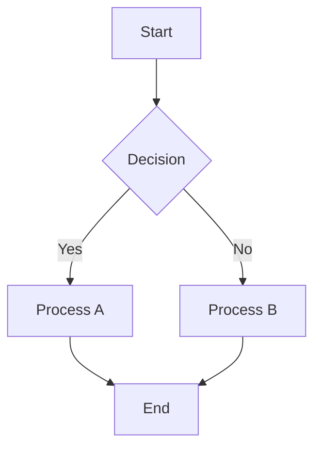
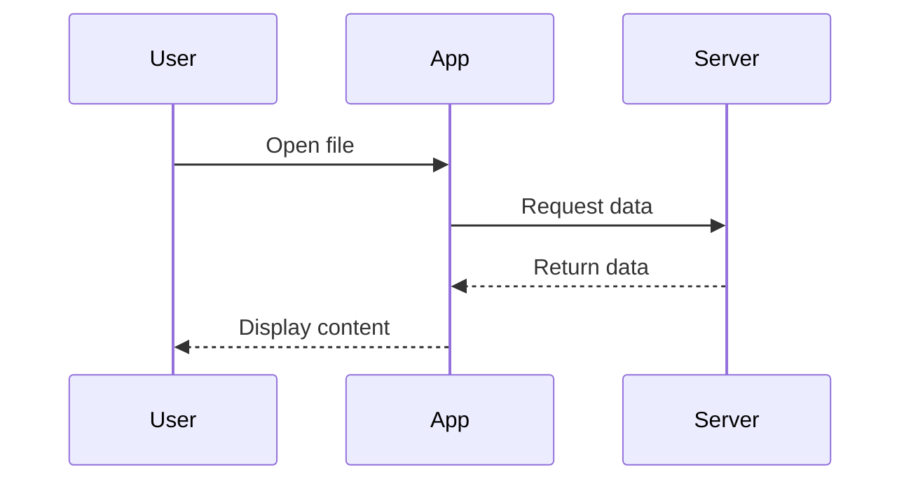
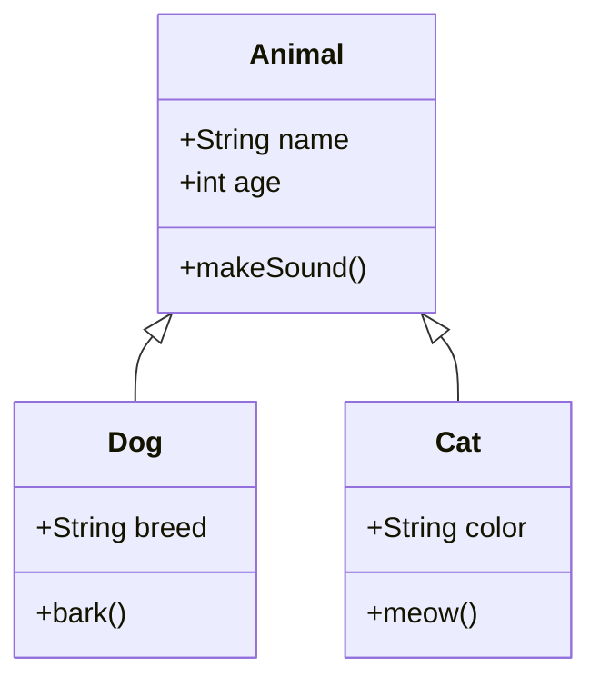
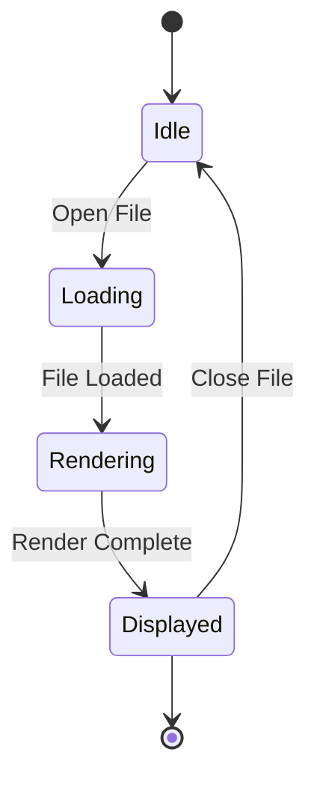
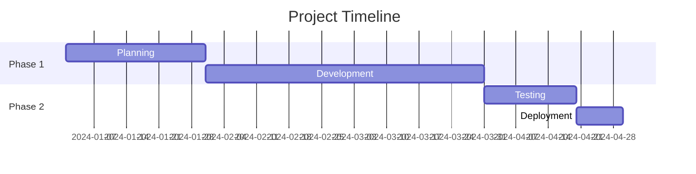
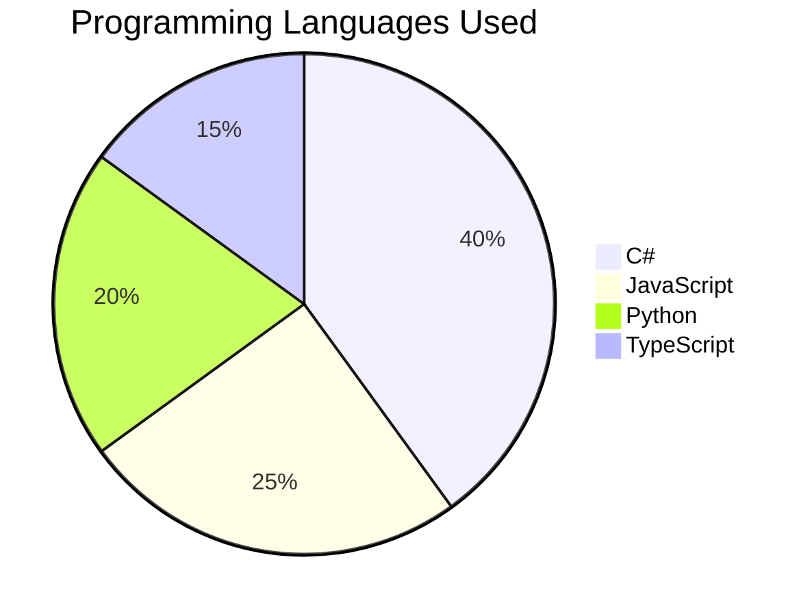
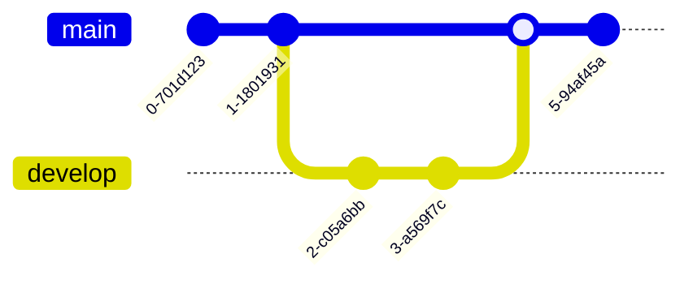

# Mermaid Diagram Examples

This document demonstrates various Mermaid diagram types supported by MarkdownViewer.

[← Back to Index](index.md)

## Flowchart

## Sequence Diagram

## Class Diagram

## State Diagram

## Gantt Chart

## Pie Chart

## Git Graph

---

**Navigation:**
- [← Back to Index](index.md)
- [Next: PlantUML Examples →](plantuml-examples.md)
