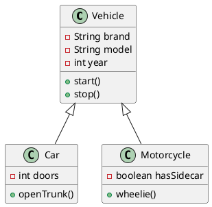
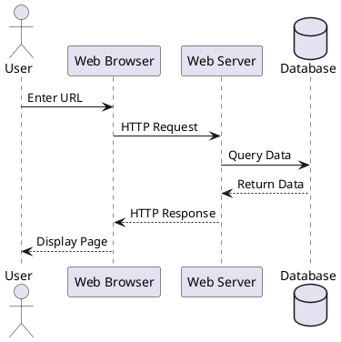
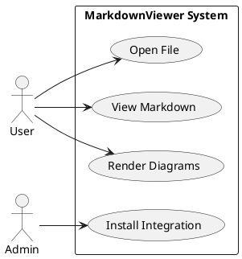
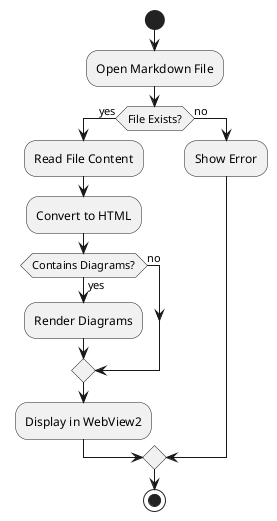
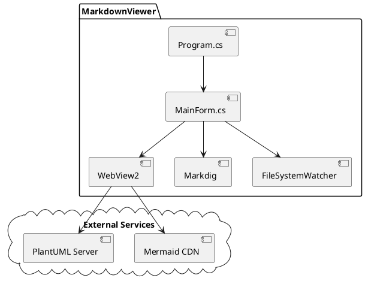
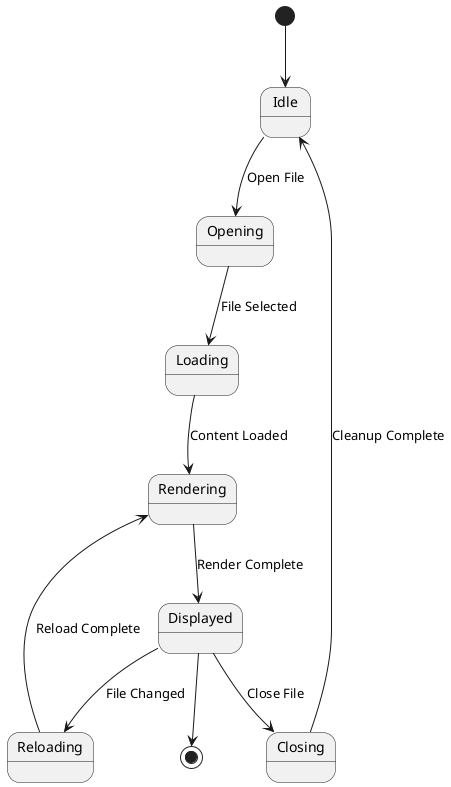
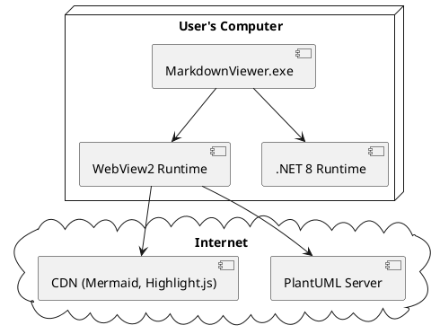
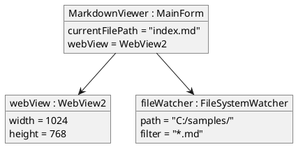

# PlantUML Diagram Examples

This document demonstrates various PlantUML diagram types supported by MarkdownViewer.

[← Back to Index](index.md)

## Class Diagram

## Sequence Diagram

## Use Case Diagram

## Activity Diagram

## Component Diagram

## State Diagram

## Deployment Diagram

## Object Diagram

---

**Navigation:**
- [← Previous: Mermaid Examples](mermaid-examples.md)
- [← Back to Index](index.md)
- [Next: Code Examples →](code-examples.md)
