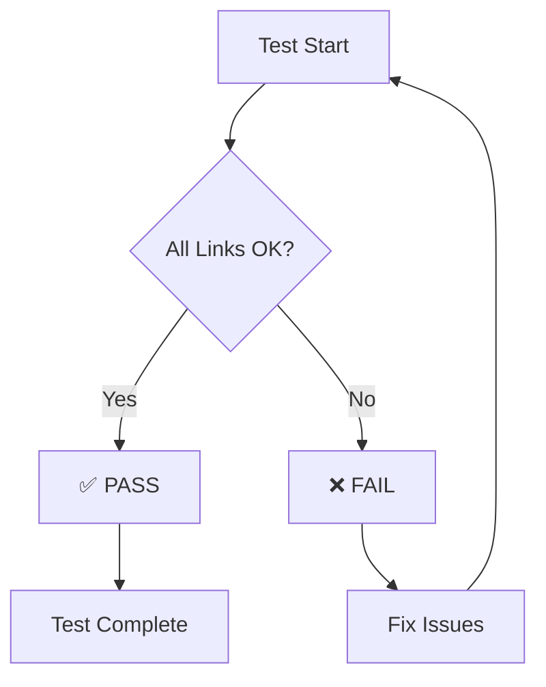
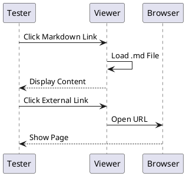

# Link Navigation Test Document

This document tests all types of links supported by MarkdownViewer.

**Test Status:** Use this file to manually verify link navigation works correctly.

---

## 1. Relative Markdown File Links

These should open in the MarkdownViewer:

### Same Directory
- [Mermaid Examples](mermaid-examples.md) - Should open in viewer
- [PlantUML Examples](plantuml-examples.md) - Should open in viewer
- [Code Examples](code-examples.md) - Should open in viewer
- [Markdown Features](markdown-features.md) - Should open in viewer
- [Back to Index](index.md) - Should open in viewer

### With File Extension Variations
- [Test Diagrams (lowercase)](test-diagrams.md) - Should work
- [Test Features (UPPERCASE)](TEST-FEATURES.MD) - Should work (case-insensitive)

### Non-Existent Files (Edge Cases)
- [This File Does Not Exist](non-existent-file.md) - Should show error, not crash

---

## 2. Anchor Links (Internal Navigation)

These should scroll to sections on this page WITHOUT navigating away:

- [Jump to External Links](#3-external-httpshttps-links)
- [Jump to Images](#4-images-and-data-uris)
- [Jump to Diagrams](#5-diagrams-mermaid--plantuml)
- [Jump to Summary](#test-summary)

**How to Test:**
1. Click an anchor link above
2. Page should scroll to that section
3. You should still be on test-navigation.md (check title)

---

## 3. External HTTP/HTTPS Links

These should open in your default web browser, NOT in MarkdownViewer:

### Regular Websites
- [GitHub](https://github.com) - Should open in browser
- [Microsoft](https://microsoft.com) - Should open in browser
- [Anthropic](https://anthropic.com) - Should open in browser

### Markdown Files on GitHub (should also open in browser)
- [GitHub README](https://github.com/nobiehl/mini-markdown-viewer/blob/master/README.md) - Should open in browser

---

## 4. Images and Data URIs

These should display inline in the viewer:

### Base64 Embedded Images

**Red Pixel (PNG):**


**Blue Pixel (PNG):**


**SVG Circle:**


### External Images (requires internet)

**GitHub Logo:**


**Expected:** All images above should display inline.

---

## 5. Diagrams (Mermaid & PlantUML)

These should render correctly (requires internet for PlantUML):

### Mermaid Flowchart



### PlantUML Sequence Diagram



**Expected:** Both diagrams should render correctly.

---

## 6. Mixed Content Test

Combining different link types:

1. First, navigate to [Mermaid Examples](mermaid-examples.md)
2. Then click "Back to Index"
3. From index, click [this test file](test-navigation.md) again
4. Scroll to [Diagrams section](#5-diagrams-mermaid--plantuml)
5. Open [GitHub](https://github.com) in browser
6. Come back and verify diagrams still render

---

## 7. Special Characters and Edge Cases

### Files with Spaces
- [File With Spaces](test-features.md) - Spaces in link text

### Unicode Filenames (if supported)
- Test: If you create `Datei.md` or `文档.md`, test those links

### URL Encoding Test
Links with special characters should work:
- Files with `%20` for spaces
- Files with `-` and `_` characters

---

## 8. Code Blocks (Should NOT be links)

```markdown
[This is not a link](should-not-work.md)
```

**Expected:** Above text should be displayed as code, not a clickable link.

---

## 9. Reference-Style Links

[ref-link-1]: mermaid-examples.md
[ref-link-2]: https://github.com

- [Reference to Mermaid Examples][ref-link-1] - Should open in viewer
- [Reference to GitHub][ref-link-2] - Should open in browser

---

## 10. Link in Blockquote

> This is a blockquote with a link to [Index](index.md).
>
> It should still work correctly.

---

## Test Summary

### Expected Behavior Checklist

When testing this file, verify:

- [ ] **Relative .md links** → Open in MarkdownViewer
- [ ] **Anchor links (#)** → Scroll on same page
- [ ] **External HTTP links** → Open in default browser
- [ ] **Base64 images** → Display inline
- [ ] **External images** → Display inline (with internet)
- [ ] **Mermaid diagrams** → Render correctly
- [ ] **PlantUML diagrams** → Render correctly (with internet)
- [ ] **Non-existent file links** → Show error gracefully
- [ ] **Navigation back/forth** → Works smoothly
- [ ] **Live reload** → Works if file is edited

### Known Limitations

- PlantUML diagrams require internet connection
- External images require internet connection
- GitHub links open in browser (by design)

---

## Navigation

- [← Back to Index](index.md)
- [Next: Mermaid Examples →](mermaid-examples.md)

---

**Test Date:** 2025-11-05
**Version:** 1.0.4 (in development)
**Purpose:** Comprehensive link navigation testing
