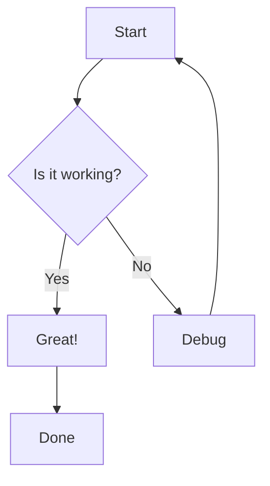
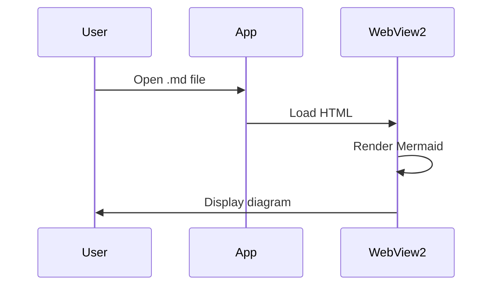
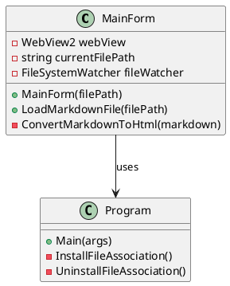
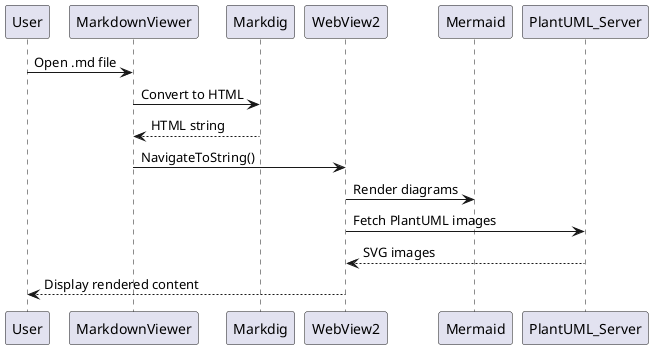

# Diagram Test für MarkdownViewer

Dieser Markdown-Test zeigt Mermaid und PlantUML Diagramme.

## Mermaid Flowchart



## Mermaid Sequence Diagram



## PlantUML Class Diagram



## PlantUML Sequence Diagram



## Code mit Syntax Highlighting

```csharp
public class Example
{
    public void HelloWorld()
    {
        Console.WriteLine("Hello, World!");
    }
}
```

**Ende des Tests**
